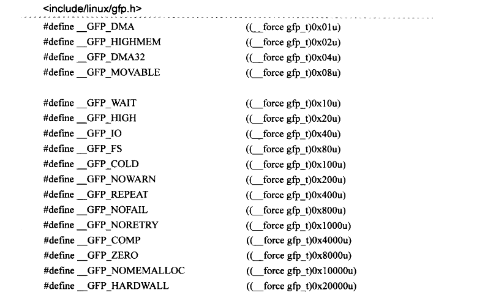
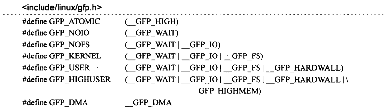

# 内存管理(未完成)

Linux下对内存的管理总体上可以分为两大类：一是对物理内存的管理；二是对虚拟内存的管理。前者用于特定的平台构架上实际物理内存空间的管理，后者用于特定的处理器体系架构上虚拟地址空间的管理。

## 1 物理内存的管理

Linux系统在对物理内存的定义方面，引入了内存节点(node)、内存区域(zone)、内存页(page)的概念。对物理内存的管理总体上分为两部分：最底层实现的页面级内存管理，然后时基于页面级管理之上的slab内存管理。

### 1.1 内存节点 node

内存节点的引入，是因为Linux系统最大程度的兼容性，将UMA系统和NUMA系统统一起来。UMA是只有一个内存节点的系统。

- UMA(一致内存访问，Uniform Memory Access)内存模型：该模型的内存空间在物理上也许是不连续的(比如空洞的存在)，但所有的内存空间对系统中的处理器而言具有相同的访问特性，即系统中所有的处理器对这些内存具有相同的访问速度。
- NUMA(非一致内存访问，Non-Uniform Memory Access)内存模型：使用这种模型的总是多处理器系统，系统中的各个处理器都有本地内存，处理器与处理器之间通过总线连接起来以支持对其他处理器本地内存的访问，与UMA模型不同的是，处理器访问本地内存的速度要快于对其他处理器本地内存的访问。

Linux源码中以struct pglist_data数据结构来表示单个内存节点。对于NUMA模型，多个内存节点通过链表串联起来。UMA模型因为只有一个内存节点，所以不存在这样的链表。

### 1.2 内存区域 zone

内存区域属于单个内存节点中的概念，考虑到系统的各个模块对分配的物理内存有不同的要求，比如x86体系架构下的DMA只能访问16MB以下的物理空间，所以Linux又将每个内存节点管理的物理内存划分为不同的内存区域，Linux源码中，以struct zone数据结构表示一个内存区域，内存区域的类型用zone_type表示(枚举类型)。

### 1.3 内存页 page

## 2 页面分配器(page allocator)

Linux系统中对物理内存进行分配的核心建立在页面级的伙伴系统上，在系统初始化期间，伙伴系统负责对物理内存页面进行跟踪，记录哪些已经被Linux内核使用，那些属于空闲。

有了伙伴系统就可以让系统分配单个页面或者连续的几个页面，驱动程序在内存分配的时候如果需要分配较大的地址空间，可以在这一层面利用页面分配器提供的接口函数。这些函数(或是宏)只能分配2的整数次幂个连续的物理页面，返回值的形式各不相同，对于驱动程序员来说理解这些函数的返回值其实更重要，后面会讨论到这些返回值。下图展示了mem_map、物理内存页面及其系统虚拟地址之间关系的一个概略示意图：

图中，每个物理页都有一个struct page对象与之对应。根据内存使用及其内核虚拟地址空间限制等因素，内核将物理内存分配为三个区：ZONE_DMA、ZONE_NORMAL、ZONE_HIGHMEM。因为mem_map中的每一个struct page对象与物理页面之间严格一一对应关系，导致mem_map所引导的struct page实例中，事实上也形成了三个区。

Linux系统初始化期间会将虚拟地址空间的物理页面直接映射区作线性地址映射到ZONE_DMA和ZONE_NORMAL，这意味着如果页面分配器所分配的页面落在这两个zone中，那么对应的内核虚拟地址到物理地址的映射的页目录表项已经建立。而且所谓的**线性映射，也就是说虚拟地址和物理地址之间只有一个差值**(PAGE_OFFSET，即图中的0xC0000000)。

而如果页面分配器所在的页面落在ZONE_HIGHMEM中，那么内核此时并没有对该页面进行地址映射，因此，页面分配器的调用者(比如设备驱动程序等内核模块)在这种情况下需要做的是：在内核虚拟地址的**动态映射区**或者**固定映射区**分配一个虚拟地址，然后映射到该物理页面上，内核提供了实现这些步骤的接口函数，内核模块只需要调用就行了。

以上就是页面分配器的大致工作原理，接下来开始讨论页面分配器所提供的接口函数，无论对于UMA还是NUMA，这些接口是完全一致的页面分配器的核心成员只有两个，分别是alloc_pages和\_\_get_free_pages，其他函数都是在二者的基础上调整某些参数而来。而alloc_pages和\_\_get_free_pages函数最终都会调用到alloc_pages_node，所以两者背后的实现原理完全一致，只是\_\_get_free_pages不能再高端内存区分配页面，此外两者返回值的形式也有所区别。

### 2.1 gfp_mask

gfp_mask并不是页面分配器函数，而只是这些页面分配函数中一个重要的参数，是个用于控制分配行为的掩码，并可以告诉内核应该到哪个zone中分配物理内存页面。这里将一些常见的gfp_mask掩码含义说明如下，然后重点讨论内核模块中使用最多的GFP_KERNEL和GFP_ATOMIC：

| **类型**         | **描述**                                                     |
| ---------------- | ------------------------------------------------------------ |
| __GFP_DMA        | 在ZONE_DMA标识的内存区域中查找空闲页。                       |
| __GFP_HIGHMEM    | 在ZONE_HIGHMEM标识的内存区域中查找空闲页。                   |
| __GFP_MOVABLE    | 内核将分配的物理页标记为可移动的。                           |
| __GFP_WAIT       | 当前正在向内核申请页分配的进程可以被阻塞，意味着调度器可以在此请求期间调度另外一个进程执行。 |
| __GFP_HIGH       | 内核允许使用紧急分配链表中的保留内存页。该请求必须以原子方式完成，意味着请求过程不允许被中断。 |
| __GFP_IO         | 内核在查找空闲页的过程中可以进行I/O操作，如此内核可以将换出的页写到硬盘。 |
| __GFP_FS         | 查找空闲页的过程中允许执行文件系统相关操作。                 |
| __GFP_COLD       | 从非缓存的“冷页”中分配。                                     |
| __GFP_NOWARN     | 禁止分配失败时的告警。                                       |
| __GFP_REPEAT     | 如果分配行为失败，可以自动尝试再次分配。尝试若干次后会终止。 |
| __GFP_NOFAIL     | 分配失败后一直重试，直到分配成功为止，分配函数的调用者无法处理分配失败的情形。根据 2.6.39 版本内核中的源码注释（__GFP_NOFAIL is not to be used in new code.），以后新代码将不再使用该掩码。 |
| __GFP_NORETRY    | 如果分配失败，不会进行重试操作。                             |
| __GFP_COMP       | 增加复合页元数据。                                           |
| __GFP_ZERO       | 用0填充成功分配出来的物理页。                                |
| __GFP_NOMEMALLOC | 不要使用仅限紧急分配使用的保留分配链表。                     |
| __GFP_HARDWALL   | 只能在当前进程允许运行的各个CPU所关联的节点分配内存。该标志只有在NUMA系统上才有意义。 |

只能在当前进程允许运行的各个CPU所关联的节点分配内存。该标志只有在NUMA系统上才有意义。

通常意义上（并非严格规定），这些以“\_\_”打头的GFP掩码只限于在内存管理组件内部的代码使用，对于提供给外部的接口，比如驱动程序中所使用的页面分配函数，gfp_mask掩码以“GFP_”的形式出现，而这些掩码基本上就是上面提到的掩码的组合，例如内核为外部模块提供的最常使用的几个掩码如下：

| **类型**          | **描述**                                                     |
| ----------------- | ------------------------------------------------------------ |
| GFP_ATOMIC        | 内核模块中最常使用的掩码之一，用于原子分配，也是上面几个掩码中唯一不带\_\_GFP_WAIT的。此掩码告诉页面分配器，在分配内存页时，绝对不能中断当前进程或者把当前进程移出调度器。必要的情况下可以使用仅限紧急情况使用的保留内存页。在驱动程序中，一般在中断处理例程或者非进程上下文的代码中使用GFP_ATOMIC掩码进行内存分配，因为这两种情况下分配都必须保证当前进程不能睡眠。 |
| GFP_KERNEL        | 内核模块中最常使用的掩码之一，带有该掩码的内存分配可能导致当前进程进入睡眠状态。 |
| GFP_USER          | 用于为用户空间分配内存页，可能引起进程的休眠。               |
| GFP_NOIO/GFP_NOFS | 都带有\_\_GFP_WAIT，因此可以被中断。前者在分配过程中禁止I/O操作，后者则是禁止文件系统相关的函数调用。 |
| GFP_HIGHUSER      | 对GFP_USER的一个扩展，可以使用非线性映射的高端内存。         |
| GFP_DMA           | 限制页面分配器只能在ZONE_DMA域中分配空闲物理页面，用于分配适用于DMA缓冲区的内存。 |

对于以上掩码，内核模块开发人员其实更关心的是页面分配器将到哪个域中分配物理页面，在页面分配过程中这实际上是由gfp_zone函数根据上述掩码来指定，如果没有在gfp_mask中明确指定\_\_GFP_DMA或者是\_\_GFP_HIGHMEM，那么默认是在ZONE_NORMAL中分配物理页，如果ZONE_NORMAL中现有空闲页不足以满足当前的分配，那么页分配器会到ZONE_DMA 域中查找空闲页，而不会到ZONE_HIGHMEM中查找。小结一下，这里的分配域优先次序是：

- \_\_GFP_HIGHMEM。先在ZONE_HIGHMEM域中查找空闲页，如果无法满足当前分配，页分配器将回退到ZONE_NORMAL域中继续查找，如果依然无法满足当前分配，分配器将回退到ZONE_DMA域，或者成功或者失败。
- 没有\_\_GFP_NORMAL这样的掩码，但是前面已经提到，如果 gfp_mask中没有明确指定\_\_GFP_HIGHMEM或者是\_\_GFP_DMA，默认就相当于\_\_GFP_NORMAL，优先在ZONE_NORMAL域中分配，其次是ZONE_DMA 域。
- \_\_GFP_DMA。只能在ZONE_DMA中分配物理页面，如果无法满足，则分配失败。

设备驱动程序中最常使用的是GFP_KERNEL与GFP_ATOMIC，两者中都没有明确指定内存域的标识符，这意味着使用它们的页分配器只能在ZONE_NORMAL和ZONE_DMA中分配物理页面。

