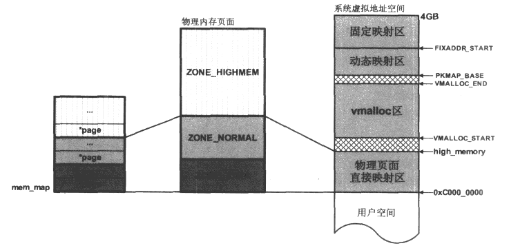
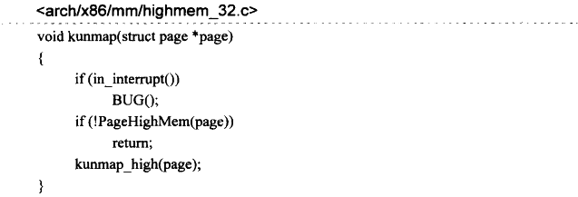
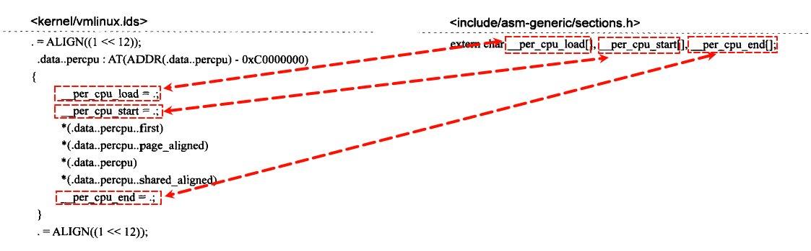

# 内存管理(未完成)

Linux下对内存的管理总体上可以分为两大类：一是对物理内存的管理；二是对虚拟内存的管理。前者用于特定的平台构架上实际物理内存空间的管理，后者用于特定的处理器体系架构上虚拟地址空间的管理。

## 1 物理内存的管理

Linux系统在对物理内存的定义方面，引入了内存节点(node)、内存区域(zone)、内存页(page)的概念。对物理内存的管理总体上分为两部分：最底层实现的页面级内存管理，然后时基于页面级管理之上的slab内存管理。

### 1.1 内存节点 node

内存节点的引入，是因为Linux系统最大程度的兼容性，将UMA系统和NUMA系统统一起来。UMA是只有一个内存节点的系统。

- UMA(一致内存访问，Uniform Memory Access)内存模型：该模型的内存空间在物理上也许是不连续的(比如空洞的存在)，但所有的内存空间对系统中的处理器而言具有相同的访问特性，即系统中所有的处理器对这些内存具有相同的访问速度。
- NUMA(非一致内存访问，Non-Uniform Memory Access)内存模型：使用这种模型的总是多处理器系统，系统中的各个处理器都有本地内存，处理器与处理器之间通过总线连接起来以支持对其他处理器本地内存的访问，与UMA模型不同的是，处理器访问本地内存的速度要快于对其他处理器本地内存的访问。

Linux源码中以struct pglist_data数据结构来表示单个内存节点。对于NUMA模型，多个内存节点通过链表串联起来。UMA模型因为只有一个内存节点，所以不存在这样的链表。

### 1.2 内存区域 zone

内存区域属于单个内存节点中的概念，考虑到系统的各个模块对分配的物理内存有不同的要求，比如x86体系架构下的DMA只能访问16MB以下的物理空间，所以Linux又将每个内存节点管理的物理内存划分为不同的内存区域，Linux源码中，以struct zone数据结构表示一个内存区域，内存区域的类型用zone_type表示(枚举类型)。

### 1.3 内存页 page

## 2 页面分配器(page allocator)

Linux系统中对物理内存进行分配的核心建立在页面级的伙伴系统上，在系统初始化期间，伙伴系统负责对物理内存页面进行跟踪，记录哪些已经被Linux内核使用，那些属于空闲。

有了伙伴系统就可以让系统分配单个页面或者连续的几个页面，驱动程序在内存分配的时候如果需要分配较大的地址空间，可以在这一层面利用页面分配器提供的接口函数。这些函数(或是宏)只能分配2的整数次幂个连续的物理页面，返回值的形式各不相同，对于驱动程序员来说理解这些函数的返回值其实更重要，后面会讨论到这些返回值。下图展示了mem_map、物理内存页面及其系统虚拟地址之间关系的一个概略示意图：

图中，每个物理页都有一个struct page对象与之对应。根据内存使用及其内核虚拟地址空间限制等因素，内核将物理内存分配为三个区：ZONE_DMA、ZONE_NORMAL、ZONE_HIGHMEM。因为mem_map中的每一个struct page对象与物理页面之间严格一一对应关系，导致mem_map所引导的struct page实例中，事实上也形成了三个区。

Linux系统初始化期间会将虚拟地址空间的物理页面直接映射区作线性地址映射到ZONE_DMA和ZONE_NORMAL，这意味着如果页面分配器所分配的页面落在这两个zone中，那么对应的内核虚拟地址到物理地址的映射的页目录表项已经建立。而且所谓的**线性映射，也就是说虚拟地址和物理地址之间只有一个差值**(PAGE_OFFSET，即图中的0xC0000000)。

而如果页面分配器所在的页面落在ZONE_HIGHMEM中，那么内核此时并没有对该页面进行地址映射，因此，页面分配器的调用者(比如设备驱动程序等内核模块)在这种情况下需要做的是：在内核虚拟地址的**动态映射区**或者**固定映射区**分配一个虚拟地址，然后映射到该物理页面上，内核提供了实现这些步骤的接口函数，内核模块只需要调用就行了。

以上就是页面分配器的大致工作原理，接下来开始讨论页面分配器所提供的接口函数，无论对于UMA还是NUMA，这些接口是完全一致的页面分配器的核心成员只有两个，分别是alloc_pages和\_\_get_free_pages，其他函数都是在二者的基础上调整某些参数而来。而alloc_pages和\_\_get_free_pages函数最终都会调用到alloc_pages_node，所以两者背后的实现原理完全一致，只是\_\_get_free_pages不能再高端内存区分配页面，此外两者返回值的形式也有所区别。

### 2.1 gfp_mask

gfp_mask并不是页面分配器函数，而只是这些页面分配函数中一个重要的参数，是个用于控制分配行为的掩码，并可以告诉内核应该到哪个zone中分配物理内存页面。这里将一些常见的gfp_mask掩码含义说明如下，然后重点讨论内核模块中使用最多的GFP_KERNEL和GFP_ATOMIC：

| **类型**         | **描述**                                                     |
| ---------------- | ------------------------------------------------------------ |
| __GFP_DMA        | 在ZONE_DMA标识的内存区域中查找空闲页。                       |
| __GFP_HIGHMEM    | 在ZONE_HIGHMEM标识的内存区域中查找空闲页。                   |
| __GFP_MOVABLE    | 内核将分配的物理页标记为可移动的。                           |
| __GFP_WAIT       | 当前正在向内核申请页分配的进程可以被阻塞，意味着调度器可以在此请求期间调度另外一个进程执行。 |
| __GFP_HIGH       | 内核允许使用紧急分配链表中的保留内存页。该请求必须以原子方式完成，意味着请求过程不允许被中断。 |
| __GFP_IO         | 内核在查找空闲页的过程中可以进行I/O操作，如此内核可以将换出的页写到硬盘。 |
| __GFP_FS         | 查找空闲页的过程中允许执行文件系统相关操作。                 |
| __GFP_COLD       | 从非缓存的“冷页”中分配。                                     |
| __GFP_NOWARN     | 禁止分配失败时的告警。                                       |
| __GFP_REPEAT     | 如果分配行为失败，可以自动尝试再次分配。尝试若干次后会终止。 |
| __GFP_NOFAIL     | 分配失败后一直重试，直到分配成功为止，分配函数的调用者无法处理分配失败的情形。根据 2.6.39 版本内核中的源码注释（__GFP_NOFAIL is not to be used in new code.），以后新代码将不再使用该掩码。 |
| __GFP_NORETRY    | 如果分配失败，不会进行重试操作。                             |
| __GFP_COMP       | 增加复合页元数据。                                           |
| __GFP_ZERO       | 用0填充成功分配出来的物理页。                                |
| __GFP_NOMEMALLOC | 不要使用仅限紧急分配使用的保留分配链表。                     |
| __GFP_HARDWALL   | 只能在当前进程允许运行的各个CPU所关联的节点分配内存。该标志只有在NUMA系统上才有意义。 |

只能在当前进程允许运行的各个CPU所关联的节点分配内存。该标志只有在NUMA系统上才有意义。

通常意义上（并非严格规定），这些以“\_\_”打头的GFP掩码只限于在内存管理组件内部的代码使用，对于提供给外部的接口，比如驱动程序中所使用的页面分配函数，gfp_mask掩码以“GFP_”的形式出现，而这些掩码基本上就是上面提到的掩码的组合，例如内核为外部模块提供的最常使用的几个掩码如下：

| **类型**          | **描述**                                                     |
| ----------------- | ------------------------------------------------------------ |
| GFP_ATOMIC        | 内核模块中最常使用的掩码之一，用于原子分配，也是上面几个掩码中唯一不带\_\_GFP_WAIT的。此掩码告诉页面分配器，在分配内存页时，绝对不能中断当前进程或者把当前进程移出调度器。必要的情况下可以使用仅限紧急情况使用的保留内存页。在驱动程序中，一般在中断处理例程或者非进程上下文的代码中使用GFP_ATOMIC掩码进行内存分配，因为这两种情况下分配都必须保证当前进程不能睡眠。 |
| GFP_KERNEL        | 内核模块中最常使用的掩码之一，带有该掩码的内存分配可能导致当前进程进入睡眠状态。 |
| GFP_USER          | 用于为用户空间分配内存页，可能引起进程的休眠。               |
| GFP_NOIO/GFP_NOFS | 都带有\_\_GFP_WAIT，因此可以被中断。前者在分配过程中禁止I/O操作，后者则是禁止文件系统相关的函数调用。 |
| GFP_HIGHUSER      | 对GFP_USER的一个扩展，可以使用非线性映射的高端内存。         |
| GFP_DMA           | 限制页面分配器只能在ZONE_DMA域中分配空闲物理页面，用于分配适用于DMA缓冲区的内存。 |

对于以上掩码，内核模块开发人员其实更关心的是页面分配器将到哪个域中分配物理页面，在页面分配过程中这实际上是由gfp_zone函数根据上述掩码来指定，如果没有在gfp_mask中明确指定\_\_GFP_DMA或者是\_\_GFP_HIGHMEM，那么默认是在ZONE_NORMAL中分配物理页，如果ZONE_NORMAL中现有空闲页不足以满足当前的分配，那么页分配器会到ZONE_DMA 域中查找空闲页，而不会到ZONE_HIGHMEM中查找。小结一下，这里的分配域优先次序是：

- \_\_GFP_HIGHMEM。先在ZONE_HIGHMEM域中查找空闲页，如果无法满足当前分配，页分配器将回退到ZONE_NORMAL域中继续查找，如果依然无法满足当前分配，分配器将回退到ZONE_DMA域，或者成功或者失败。
- 没有\_\_GFP_NORMAL这样的掩码，但是前面已经提到，如果 gfp_mask中没有明确指定\_\_GFP_HIGHMEM或者是\_\_GFP_DMA，默认就相当于\_\_GFP_NORMAL，优先在ZONE_NORMAL域中分配，其次是ZONE_DMA 域。
- \_\_GFP_DMA。只能在ZONE_DMA中分配物理页面，如果无法满足，则分配失败。

设备驱动程序中最常使用的是GFP_KERNEL与GFP_ATOMIC，两者中都没有明确指定内存域的标识符，这意味着使用它们的页分配器只能在ZONE_NORMAL和ZONE_DMA中分配物理页面。

### 2.2 alloc_pages

alloc_pages函数负责分配2^order个连续的物理页并且返回起始页的struct page实例。此时分为两种情况：

① 如果gfp_mask没有明确指出\_\_GFP_HIGHMEM，那么分配的物理页面必然来自ZONE_NORMAL或者ZONE_DMA。由于这两个域中内核再初始化阶段就为之建立了映射关系，所以内核模块可以使用page_address来获得对应页面的内核虚拟地址KVA(Kernel Virtual Address)。因为是线性映射，所以此时获得KVA很简单，伪代码大致流程如下：

② 如果在调用alloc_pages时在gfp_mask指定了\_\_GFP_HIGHMEM，那么页分配器将优先从ZONE_HIGHMEM域中分配物理页，但是也不排除ZONE_HIGHMEM没有足够的空闲页而导致在ZONE_NORMAL和ZONE_DMA中分配的可能。当然，对于新配的\_\_GFP_HIGHMEM高端物理页面，由于内核尚未在页表中建立映射关系，所以此时需要：

- 在内核的动态映射区分配一个KVA。
- 通过操作页表，来将KVA映射到该物理页面上。内核为此提供了一个函数kmap。

> [!NOTE]
>
> kmap函数在执行中可能睡眠，所以不能用在中断处理等上下文中。内核针对函数可能睡眠的情形提供了另外一个备选函数kmap_atomic，该函数的执行时原子的，而且比kmap要快。
>
> 高端内存的分配涉及到页表的操作，所以从高端内存分配物理页对系统的开销还是比较大的。

与kmap行为相反的函数时kunmap，在x86平台上的定义如下：

函数将在页表项中拆除对page的映射，同时将来自内核映射区中的KVA释放出去，这样该KVA可以被再次映射到别的物理页面。

另一个分配函数是alloc_page，只用于分配一个物理页面。alloc_page(gfp_mask)是order=0时alloc_pages的简化形式，只分配单个页面。

> [!NOTE]
>
> 如果系统中没有足够的空间页来满足alloc_pages的分配，函数将返回NULL，内核模块需要仔细检查alloc_pages函数的返回值，来作出适当的应对。

### 2.3 __get_free_pages

函数负责分配2^order 个连续的物理页面，返回起始页面所在内核线性地址。函数内部调用alloc_pages 负责实际的页面分配工作。

从函数源码中可以看到，\_\_get_free_pages 不能从高端内存中分配物理页，VM_BUG_ON宏在CONFIG_DEBUG_VM定义的情形下可以捕捉到这一错误，如果CONFIG_DEBUG_VM没有定义，且调用者在gfp_mask中设置了\_\_GFP_HIGHMEM 掩码，那么\_\_get_free_pages 返回 O。在正常情况下，\_\_get_free_pages从低端内存区中分配2^order 个连续物理页面，并通过 page_address 来返回这些页面中起始页面的内核线性地址。

如果内核模块只想分配单个物理页面，那么可以使用\_\_get_free_page(gfp_mask)，它是order=0时\_\_get_free_pages的简化形式。

### 2.4 get_zeroed_page

该函数用于分配一个物理页，同时将对应页面的内容全部填充为0，函数返回页面所在的内核线性地址。

### 2.5 __get_dma_pages

该函数用于从ZONE_DMA区域中分配物理页，返回物理页所在的内核线性地址。

### 2.6 __free_pages和free_pages

这两个函数是内核提供的释放物理页的函数，它们的背后原理基本一样(free_pages函数内部最终调用\_\_free_pages来完成页面的释放工作)，只不过在函数的原型定义方面有所区分：

- \_\_free_pages的参数主要是alloc_pages返回的page对象指针。
- free_pages的参数主要是\_\_get_free_pages返回的内核线性虚拟地址。

## 3 slab分配器

上节提到的页面分配器用于连续物理页面的分配，驱动程序中可以使用这些函数来分配一大块连续的内存空间。然而只是有页面级的内存分配函数还不够，因为很多情况下我们需要分配比4KB要小很多的物理地址空间，比如只有几十或者几百个字节，如果对这样的地址空间需求也分配一个完整的物理页，显然会对物理内存的使用造成巨大浪费。基于这一需求，Linux系统在物理页分配的基础上实现了对更小内存空间进行管理的slab、slob和slub分配器。slab是Linux内核最早推出的小内存分配方案，slob和slub分配器则是Linux2.6内核开发期间新增的slab分配器的替代品，主要针对大型系统和嵌入式系统。本书并不会详细讨论这些分配器的具体实现细节，所以下文中将slab、slob和slub统称slab分配器。

slab分配器的原理是很简单的，但是具体到代码层面，由于牵涉到多方面的考虑，包括最大兼容性、优化以及调试等，这部分代码相当烦晦涩。本书因为是从驱动程序的角度出发，所以会侧重于驱动程序使用的内存分配的接口函数方面，对这部分内容只需要在相对高点的层面了解slab分配器的实现思想就足够了。

slab分配器的基本思想是，先利用页面分配器分配出单个或者一组连续的物理页面，然后在此基础上将整块页面分割成多个相等的小内存单元，以满足小内存空间分配的需要。当然，为了有效地管理这些小的内存单元并保证极高的内存使用速度和效率，内核代码的复杂度要远远超出其基本思想所展现的面貌。但是这并不影响我们以框架的形式来揭示这些代码背后最实质性的东西：抛开烦的细节，以粗线条的形式勾勒出slab分配器的主干部分。

### 3.1 管理slab的数据结构

## 4 内存池

设备驱动程序对内存池的使用机会已经非常渺茫，在Linux2.6.39版本的源码中，仅有屈指可数的几个驱动模块还在使用内存池，读者大可跳过本节（不会对手头的工作有任何影响)。本书之所以还要在这里提一下内存池的概念，只是出于让读者增加点信息量的考虑，假使某天有面试官提出诸如茴香豆的“茴”字有几种写法之类的问题（实际的面试中这类问题居然不在少数)，你不至于太沮丧。

内存池的总体思想是：预先为将来要使用的数据对象（比如a）分配几个内存空间，把这些空间地址存放在内存池对象中。当代码真正需要为a分配空间时，正常调用前面儿节提到的分配函数，如果分配失败，那么此时便可从内存池中取得预先分配好的a的地址空间。

所以内存池的概念实际上没有任何新鲜的东西，其分配函数的核心依然是前面介绍过的那些函数，其对实际内存分配失败时的补救措施也只限于预先分配的那些空间。

## 5 虚拟内存

主流的32位处理器（比如IA32、ARM等）能寻址2^32B也即4GB大小的地址空间，这部分空间称为虚拟地址空间。从虚拟地址到物理地址的转换通过处理器中的一个部件内存管理单元MMU（MemoryManagementUnit）完成，为完成这种转变，系统软件比如操作系统必须建立适当的页表。

Linux内核将4GB的虚拟地址空间划分为两大块：顶部的1GB空间给内核使用，称为内核空间；底部的3GB给用户空间使用，称为用户空间5。内核代码中用PAGE_OFFSET宏来标示虚拟地址空间中内核部分的起始地址。

只讨论跟驱动程序关系密切的1GB的内核空间。为了讲述下面的vmalloc相关内存分配函数，有必要先讨论一下内核是如何使用1GB的内核空间的。

### 5.1 内核虚拟地址空间的构成

内核将1GB的内核空间大体分为三个部分：

- 位于1GB的开头，用于对系统物理内存的直接映射(本文也称线性映射)，内核用全局变量high_memory来表示这段空间的上界。
- 位于中间，主要用于vmalloc函数(本文也称VM区或者vmalloc区)。
- 位于结尾，用于特殊映射。

具体的1GB空间划分如下图所示：

图中白色区域为1GB虚拟空间中的“空洞”，空洞部分不作任何映射，主要用作安全保护，防止不正确的越界内存访问(越界如果进入空洞地带，因为此处没有进行任何形式的映射，对应的页表项将会使得处理器产生一个异常)。

### 5.2 vmalloc和vfree

#### vmalloc

vmalloc函数是内核模块会使用到的一个内存分配函数，该函数的特点是分配的虚拟地址空间是连续的，但是这段虚拟地址空间所映射的物理地址可能是不连续的。vmalloc函数主要是对上图中的vmalloc区进行操作，它返回的地址就来自该区域。

在驱动程序中并不鼓励使用vmalloc函数，这主要是出于以下几个方面的考虑：首先，vmalloc的实现机制决定了它的使用效率没有kmalloc这样的函数高：其次，在某些体系结构比如x86上，因为物理内存通常都比较大，这使得vmalloc区域相对变得很小，对vmalloc的调用失败的可能性增大。当然在嵌入式领域，内存通常都比较小，这个问题并不是很明显；最后，vmalloc分配出的地址空间在物理上并不能保证是连续的，这对那些要求物理地址空间连续的设备比如DMA造成了麻烦。

然而，在某些情况下，如果获得连续物理内存的可能性不是很大，那么可以通过vmalloc来用不连续的物理内存组装出一块连续的内存区域（在虚拟地址空间）。在“内核模块”一章中看到的模块加载过程，就使用了vmalloc来为模块的ELF文件数据分配空间，这主要是因为模块可以随时被加载进系统，如果系统运行了很长的时间而且模块的ELF文件又比较大，就很有可能无法分配出连续的物理空间来容纳ELF文件中的数据，所以内核选择用vmalloc来为模块分配空间。下面简单讨论vmalloc函数的实现原理。

vmalloc的实现原理可简单概括为三大步骤：

- 在valloc区分配出一段连续的虚拟内存区域。
- 通过伙伴系统获得物理页。
- 通过对页表的操作将步骤1中分配的虚拟内存映射到步骤2中获得的物理页上。

**步骤1**

在内核具体实现代码上，步骤1使用红黑树来解决vmalloc区中动态虚拟内存块的分配和释放。对于vmalloc区中每一个分配的虚拟内存块，内核用struct vm_struct对象来表示。

相关重要成员解释如下：

| **成员**  | **描述**                                                     |
| --------- | ------------------------------------------------------------ |
| next      | 用于把vmalloc区中所有已经分配的struct vm_struct对象构成链表，该链表的表头为一全局变量**struct vm_struct *vmlist**。 |
| addr      | 对应虚拟内存块的起始地址，应该是页对齐。                     |
| size      | 虚拟内存块的大小，总是页面大小的整数倍。                     |
| flags     | 表示当前虚拟内存块映射特性的标志。                           |
| pages     | 被映射的物理内存页面所形成的数组首地址。                     |
| nr_pages  | 映射的物理页的数量。                                         |
| phys_addr | 多在ioremap函数中使用，表示映射的I/O空间的起始地址，页对齐。 |

> [!NOTE]
>
> 本节只讨论VM_ALLOC和VM_IOREMAP，剩下的内容可查看[内存映射与DMA](/_docs/linux/drive_development/kernel_mechanism/10_内存映射与DMA.md)章节。
>
> - VM_ALLOC：表示当前虚拟内存块是给vmalloc函数使用，映射的是实际物理内存(RAM)。
> - VM_IOREMAP：表示当前虚拟内存块是给ioremap相关的函数使用，映射的是I/O空间，也就是设备内存。

这一步骤需要注意的是，内核总会把vmalloc函数的参数size调整到页对齐，同时会在调整后的数值上再加一个页面的大小，目的是为了防止可能出现越界访问。

因为步骤3的页表操作中并不会向这个附加在末尾的虚拟地址上提交实际物理页面，所以当右访问进入这个区间时，处理器将会产生异常。此原理跟前面提到的“空洞”完全一样。

**步骤2**

步骤2中内核在调用伙伴系统获取物理内存页时，使用了GFP_KERNEL | \_\_GFP_HIGHMEM标志。

- GFP_KERNEL标志意味着vmalloc函数在执行过程中可能睡眠，因此不能在中断等非进程上下文中调用。
- \_\_GFP_HIGHMEM标志告诉伙伴系统在ZONE_HIGHMEM区中查找空闲页，这是因为ZONE_NORMAL区中的物理内存资源非常宝贵，主要留个kmalloc这类函数使用来获得连续的物理内存页，因此，对于vmalloc函数应该尽量使用高端的物理内存页。

此外，内核在分配物理页时使用alloc_page或者是order=0情形下的alloc_page_node函数，这意味着内核在此处是以每次分配单个页面来完成物理页面的分配，这与vmalloc的设计初衷是完全吻合的：**用于分配大块内存但无须保证物理内存空间的连续性**。

**步骤3**

步骤3中没有特别需要注意的地方，唯一的一点就是不对步骤1中内存区域末尾的4KB大小部分做映射(步骤2中当然也不会为这段虚拟地址空间分配物理页)

下图展示了用vmalloc函数分配内存的情形：

vmalloc区分配出来的虚拟内存块经过内页表的配置后，被映射到了高端内存中的两个离散的物理页面205和273，虚拟内存块的最后一个页面没有映射到实际的物理页上，主要起到对可能出现越界访问的保护作用。

#### free

用来释放vmalloc获得的虚拟内存块，主要的执行操作如下：

- 红黑树算法释放vmalloc生成的节点。
- 清除内核页表中对应表项。
- 调用伙伴系统一页一页地释放由vmalloc映射的物理页。
- kfree掉管理数据所占的内存。

### 5.3 ioremap

ioremap函数(宏)是体系架构相关的。

此处\_\_iomem的作用主要是提醒调用者返回的是一个io类型的地址，如果\_\_user、\_\_precpu一样，某些工具软件有可能会利用这些定义符做一些诸如代码质量等方面的检查。

ioremap函数及其变种用来将vmalloc区的某段虚拟内存块映射到I/O空间，其实现原理与vmalloc函数基本上完全一样，都是通过在vmalloc区分配虚拟地址块，然后修改内核页表的方式将其映射到设备的内存区，也就是设备的I/O地址空间。

> [!NOTE]
>
> 与vmalloc函数不同的是，ioremap并不需要通过伙伴系统去分配物理页，因为ioremap要映射的目标地址是I/O空间，不是物理内存。

因为I/O空间在不同的体系架构上有不同的解释，比如**IA32架构上有独立于内存访问指令之外的I/O指令，ARM的架构上则没有**，所以在函数返回地址的使用上，有些要注意的地方，假设返回地址是pVaddr：

- 对于有专门I/O指令的体系，比如IA32，不能直接用内存访问的方式来使用该地址，\*pVaddr=0x1234是错误的，应该使用readw(pVaddr)，后者实际上使用了inw指令，这是IA32架构上专门的I/O指令。
- 而在ARM处理器上，\*pVaddr=0x1234则是完全正确的。

因此，为了简化不同的架构平台代码移植工作，对于ioremap返回的地址，应该统一使用readb/writeb、readw/writew这样的宏，这些宏在不同的平台上会展开成架构相关的代码。

实际代码中ioremap还有一些相关的变体，包括ioremap_nocache、ioremap_cached等，这些变体的主要功能是通过加入一些映射标志位来影响相关内核页表项的设置，比如设备驱动程序中最常用的ioremap_nocache，就是通过清除页表项中的C(cache)标志，使得处理器在访问这段地址时不会被cache，这对外设空间的地址是非常重要的。

如果被映射的I/O 空间不再使用，应该使用iounmap 函数来做相关的清除工作，iounmap函数要完成的工作包括将vmalloc区中分配的虚拟内存块返还给vmalloc区，清除对应的页表页目录项等。

## 6 per-CPU变量

参考资料：

- [PERCPU变量实现 - 知乎 (zhihu.com)](https://zhuanlan.zhihu.com/p/260986194)

- [简要剖析Linux内存管理系统中的PERCPU变量分配器 - 知乎 (zhihu.com)](https://zhuanlan.zhihu.com/p/541989131)

本来 per-CPU变量可以在“互斥与同步”一章中介绍，但鉴于其实现的核心部分在于对这些变量空间的分配和使用上（这其实是Linux内核中另一种内存分配的形式，源码中称之为(percpu memory allocator)，因此，本章前面提供的上下文环境是最适合讨论per-CPU变量实现机制的地方，故而本节将用一定的篇幅讨论一些其内部的实现机制。当然，对per-CPU 变量的使用上，也会有具体的案例给出，并在此基础上探讨 per-CPU 变量与互斥问题之间的关联。

per-CPU变量是Linux内核中一个非常有趣的特性，它为系统中的每个处理器都分配了该变量的一个副本。这样做的好处是，在多处理器系统中，当处理器操作属于它的变量副本时，不需要考虑与其他处理器竞争的问题，同时该副本还可以充分利用处理器本地的硬件缓存以提高访问速度。然而读者不应该认为只要使用的是per-CPU变量，在并发访问方面就一定是安全的，本节结束的地方会有些这方面的思考。

基于per-CPU变量的以上特性，其最典型的应用场合是在统计计数方面（为此内核源码中专门提供了基于per-CPU的一个计数器实现，感兴趣的读者可参考lib/percpu_counter.c）。例如在网络系统中，内核需要跟踪已接收到的各类数据包的数量，而这些数量在系统中更新的频率极快，每秒可能成千上万次。此时就可以使用per-CPU变量，让系统中每个处理器都使用独属于自已的该变量的副本，这样在变量更新时就无须考虑多处理器的锁定问题，可以提高性能。如果需要统计出系统接收数据包的总量，只要将各处理器副本中的值相加即可。

下面通过Linux实际代码来探究per-CPU变量的实现机制（基于SMP系统讨论）。per-CPU变量按照存储变量的空间来源可以分为静态per-CPU变量和动态per-CPU变量：前者的存储空间是在代码编译时静态分配的：后者的存储空间则是在代码的执行期间动态分配的。先讨论静态per-CPU变量。总体上说，要使一个静态per-CPU变量能够工作，除了特别的per-CPU变量声明，还必须有链接脚本和相关内核源码的配合。

### 6.1 静态per-CPU变量的声明与定义

通过上面per-CPU的声明和定义，似乎处理把变量放到".data..percpu"section里面，和其他普通变量的声明和定义相比并无什么特殊之处。

### 6.2 静态per-CPU变量的链接脚本

内核在编译链接时会把所有静态定义的per-CPU变量统一放到".data..percpu"section中，链接器生成\_\_per_cpu_start和\_\_per_cpu_end两个变量来表示该section的起始和结束地址，并且配合链接器的行为，内核源码导入了链接脚本中的相关变量。

### 6.3 set_per_cpu_areas函数

前面提到用DEFINE_PER_CPU定义的变量，系统中的每个CPU都拥有该变量的一个副本。但到目前为止，我们看到的int dolphin变量只在".data..percpu"section中才有一份，内核如何让系统中每个CPU都拥有该变量的一个副本呢？

答案在于系统初始化期间调用的setup_per_cpu_areas函数，这个函数不但会完成变量副本的生成，而且会对per-CPU变量的动态分配机制进行初始化。

#### 6.3.1 静态per-CPU变量副本的产生

下图大体勾画了这一过程，下面的讨论的内容都可以参考此图。

该函数主要完成的内容如下：

① 计算出".data..percpu"section的空间大小(static_size = \_\_per_cpu_end - \_\_per_cpu_start)，此处正是利用上面链接脚本中的内容，static_size是内核源码中所有用DEFINE_PER_CPU及其变体所定义出的静态per-CPU变量所占空间大小。此外内核还为模块使用的per-CPU变量及其动态分配的per-CPU变量预留了空间(对应图中的reserved和dynamic部分)，大小分别记为reserved_size和dynamic_size。

② setuo_per_cpu_areas函数调用alloc_bootmem_nopanic来分配一段内存，用于保存per-cpu变量副本。由于setup_per_cpu_areas函数初始化的调用在内存初始化的前面，此时因为Linux系统的物理内存管理系统还没有建立起来，所以使用的是Linux引导期内存分配器，这块内存的大小依赖于系统中CPU的数量，因为要为每个CPU创建变量副本。内核代码称每个CPU变量副本所在内存空间为一个unit，unit_size=PFN_ALIGN(static_size + reserved_size + dynamic_size)。如此，变量副本所在空间的大小就是nr_unit*unit_size。指针变量指向pcpu_base_addr指向副本空间的起始地址。

容纳副本的空间有了，接下来就是把内核映像".data..percpu"section中的变量数据复制到pcpu_base_addr空间，具体代码如下：

至此，系统针对DEFINE_PER_CPU定义的变量已经为每个CPU产生了一个副本，接下来的问题是如何使用这些变量的副本。不过在进入这一话题之前，先稍微扩展这里讨论的内容范围，探讨per-CPU变量的动态分配机制。

#### 6.3.2 动态per-CPU变量副本的产生

动态分配一个per-CPU变量可以使用下面两种方法：

alloc_percpu(1)本质上还是调用了\_\_alloc_percpu(2)，只是使用了默认参数\_\_alignof\_\_(type)。如果有对对齐方式有特殊要求，建议使用\_\_alloc_percpu函数。对应的释放函数为：

关于动态per-CPU变量的分配机制，内核中的相关代码比较繁琐，但是核心思想同静态per-CPU一样，大致分为两个部分：

- 为系统中的每个CPU分配副本的空间。
- 通过某种机制实现对CPU特定的副本空间的访问(后面会介绍到)。

**第一部分**

前面已经看到静态per-CPU变量是如何达成这一目标的，因为静态定义的变量所在空间大小是预先确定的，所以内核能很轻易完成副本空间的分配和变量数据的复制。

但是对于动态分配的per-CPU变量，则没有这么幸运，变量可以随时被申请，也可以随时被释放。为此，内核使用一种基于chunk的手法来实现，chunk作为一种存放管理数据的容器而存在，根据其上空闲空间的大小而在一个pcpu_slot数组所表示的链表中进行迁移，数组的索引i指明了其链表中chunk空闲空间的大小，当需要动态分配一个per-CPU变量时，内核在pcpu_slot数组中查找有无chunk的空闲空间满足需要，如果有，就在此chunk的空闲空间中为系统中的每个CPU生成变量的副本空间（pcpu_populate_chunk），如果没有，就重新创建一个新的 chunk，对于新分配的chunk，会在内核虚拟地址空间的vmalloc区为它分配副本空间（这是一个虚拟地址连续的，包含了系统中所有CPU的副本的存储空间)，空间的起始地址保存在chunk的base_addr成员中。chunk用一个整型数组map来跟踪副本空间的分配情况，当要分配一个动态per-CPU变量时，就在副本空间查找空闲区域，找到之后为每个CPU都分配出存储该per-CPU变量的存储小块。注意此时存储 per-CPU变量的空间还是在vmalloc区，如果之前该存储小块上还没有映射物理页面的话，需要为新分配变量映射新的页面，物理页通过页分配器从伙伴系统获得，chunk通过成员变量populated来跟踪物理页面的提交。读者仔细看看源码就会发现，chunk其实是整个percpu memory allocator的基础，即使是静态per-CPU变量，最终也都被统一到了chunk的体系当中（从前面对静态per-CPU变量实现机制的讨论，静态per-CPU变量其实并不需要chuck)，内核创建的第一个chunk就是用来管理内核中定义的静态 per-CPU 变量（pcpu_setup_first_chunk），这个 chunk 中的 base_addr 就是前面图中的 pcpu_base_addr，不过这第一个chunk 有点特殊，它的副本空间是通过Linux引导期内存分配器获得的。

总之，执行期生成的chunk在vmalloc区分配副本空间，通过map成员跟踪空间分配信息，通过 populated 成员跟踪物理页面的提交信息。对此过程的详细描述读者可参考www.embexperts.com。

概括下来，alloc_percpu返回的是chunk->base_addr+offset－delta（此处的offset是刚分配的 per-CPU变量在CPUO所属的副本空间的偏移量，delta将在下面的“使用per-CPU变量”一节中讲述），在访问该变量CPU特定的副本时，需要在该地址上使用“某种机制”获得CPU特定的变量所在地址，然后才可以进行访问。

至此，所有关于静态和动态per-CPU变量副本空间的问题都已经解决，处理器拥有了自己独立的变量空间，该是使用它们的时候了。访问per-CPU变量的要点是根据不同的处理器获得对应的变量副本。

### 6.4 使用per-CPU变量

已经有了per-CPU变量副本所在空间的首地址，现在我们需要“某种机制”来访问它。在内核源码中，“某种机制”的现实表现形式是内核定义的一组宏，为了正确访问per-CPU变量，应该在代码中使用这些宏。为了了解访问per-CPU变量的“某种机制”，下面以get_cpu_var宏为例来说明对静态per-CPU变量的访问。

#### 6.4.1 静态per-CPU变量的访问

代码中\_\_per_cpu_offset是用来实现处理器副本访问的基础，每个处理器副本所在空间的偏移地址都由\_\_per_cpu_offset引出，这是个全局性的数组变量：

该数组的初始化出现在setup_per_cpu_areas函数中，内核在启动阶段调用这个函数来初始化per-CPU变量机制：

该函数主要完成事宜如下：

- 首先计算出副本空间首地址(pcpu_base_addr)与".data..percpu"section首地址(\_\_per_cpu_start)之间的偏移量delta。
- 得到所有cpu的per-CPU副本的偏移值，放在\_\_per_cpu_offset数组中。其中pcpu_unit_offset是个数组，保存对应cpu所在副本空间相对于pcpu_base_addr的偏移量。

这样，对于CPU0中的变量var，它的地址为&val + \_\_per_cpu_offset[0]。对于CPU1中的变量var，它的地址为&val + \_\_per_cpu_offset[1]。

其中preempt_disable()用来关闭内核可抢占性，这是因为对于可抢占内核而言，即使是在单处理器上，依然会出现竞争的情况。

关闭内核可抢占性可确保对per-CPU变量操作的临界区中，当前进程不会被让出处理器。由于该因素的存在，需要有一个和get_cpu_var配对使用的宏put_cpu_var，来恢复内核调度器的可抢占性。

如果需要读取其他处理器中的副本，可以使用per_cpu(var, cpu)：

示例程序：

上面的例子中首先定义了一个数据结构structbirth_day作为per-CPU变量的类型，然后用DEFINE_PER_CPU定义了一个per-CPU变量my_birthday，最后用get_cpu_var来使用该变量。在多处理器系统中，当CPU0执行到get_cpu_var时，因为宏展开后的raw_smp_processor_id()，所以它将获得属于它的my_birthday变量的副本。

对于动态分配的per-CPU变量，在前面的“动态per-CPU变量副本的产生”部分中已经介绍了内核如何为动态分配的per-CPU变量分配存储空间。下面看看系统是如何访问动态per-CPU 变量的。

#### 6.4.2 动态per-CPU变量的访问

访问动态 per-CPU 变量通过宏 per_cpu_ptr:

前面已经提到过SHIFT_PERCPU_PTR，和静态per-CPU变量一样，用来产生CPU特定的变量存储空间的地址。到此，为了完整动态per-CPU变量的实现机制，我们把前面的内容与这里的讨论串联一下，首先我们通过 alloc_percpu获得了变量的一个地址，该地址的值ptr=chunk->base_addr+offset－delta，此处offset是该变量在CPUo副本空间的偏移量，然后假设CPU1要访问属于它自己的变量，那么它应该使用per_cpu_ptr(ptr,1)，这相当于：chunk->base_addr + offset - delta + delta+ pcpu_unit_offsets[1]，由于pcpu_unit_offsets[1]=unit_size，也就是每个CPU副本空间的大小，所以 per_cpu_ptr(ptr,1)= chunk->base_addr+offset+unit_size，这样就得到了CPU1中该变量的实际虚拟地址（在vmalloc区）。

理论上的原理大致如此，下面结合一个实例具体分析(以下以Linux2.6.35版本内核树中drivers/dma/dmaengine.c使用动态分配per-CPU变量的具体代码)：

如果考虑到内核的抢占性可能造成的问题，那么在使用per_cpu_ptr的时候需要用get_cpu和put_cpu来关闭和开启内核的可抢占性，如下代码所示：

这里关于可抢占性的问题在于，假设内核启动了调度器的可抢占特性，如果在L0与L1之间发生中断的话，当前进程可能被切换出处理器CPU0，那么等到下次该进程被调度执行时，调度器在极端情况下可能把该进程提交到另一个处理器CPU1上运行，CPU1拥有-个指向CPU0本地变量副本的指针，此时当初per-CPU变量被设计出来的初衷就被破坏了。更深层地探讨本例中出现的问题，貌似是把ptr的获得和使用分散开造成的，然而，若不能保证对per_cpu_ptr使用的原子性，这个问题总是存在的（虽然其出现的概率异常渺茫）。

所以为安全起见，per_cpu_ptr结合get_cpu和put_cpu的配对使用，总是没错的。
