# 互斥与同步(未完成)

## 1 并发的来源

### 1.1 中断处理路径

当系统正在执行当前当前进程时，发生了中断，中断函数和被中断的进程之间形成的并发，在单处理器中，虽然中断处理函数的执行路径和被中断的进程之间不是真正严格意义上的并发，然而中断处理函数和被中断进程之间可能成为竞态。软中断的执行也可归结到这类并发中。

### 1.2 调度器的可抢占性

在单处理器上，因为调度器的可抢占特性，导致的进程与进程之间的并发，这种行为非常类似多处理器系统上进程间的并发。

### 1.3 多处理器的并发执行

多处理器系统上进程与进程之间是严格意义上的并发，每个处理器可独自调度一个进程，在同一时刻有多个进程在同时运行。

## 2 local_irq_enable与local_irq_disable

在单处理器不可抢占系统中，local_irq_enable(打开本地处理器的中断)与local_irq_disable(关闭本地处理器的中断)是消除异步并发源的有效方式。

> [!NOTE]
>
> 内核可抢占和内核不可抢占是操作系统中的两种不同调度策略。
>
> 内核可抢占是指系统在内核态运行时允许进程发生切换。当一个进程在内核态运行时，如果有更高优先级的进程出现，并且当前内核允许抢占，那么可以将当前进程挂起，让更高优先级的进程进入内核态运行。这种调度策略可以提高系统的响应速度和资源利用率。内核抢占的主要特点是，一个在内核态运行的进程可能在执行内核函数期间被另外一个进程取代。
>
> 内核不可抢占则是指系统在内核态运行时不允许发生进程切换。不管多高优先级的任务，都必须等待当前CPU任务完成或者当前CPU任务主动退出后才可以执行。这种调度策略可以保证系统的稳定性和可靠性，但可能会影响系统的性能和响应速度。


其中 trace_hardirqs_onO和 trace_hardirqs_offO用做调试，这里重点关注raw_local_irq_enableO和raw_local_irq_disableO，这两个宏的具体实现都依赖于处理器体系架构，不同处理器有不同的指令来启用或者关闭处理器响应外部中断的能力，比如在x86平台上，会最终利用sti和cli指令来分别设置和清除x86处理器中的FLAGS1寄存器的IF标志，这样处理器就可以响应或者不响应外部的中断。ARM平台则使用CPSIE指令。

```c
local_irq_disable() // 关闭处理器中断
/* 访问共享资源 */
.....
local_irq_enable() // 打开处理器中断
```

local_irq_enable与local_irq_disable还有一种变体，是local_irq_save与 local_irq_restore宏，定义如下：


这两个宏相对于local_irq_enable与local_irq_disable 最大的不同在于，local_irq_save 会在关闭中断前，将处理器当前的标志位保存在一个unsigned long flags中，在调用local_irq_restore的时候，再将保存的flags恢复到处理器的FLAGS寄存器中。这样做的目的是，防止在一个中断关闭的环境中因为调用local_irq_disable与local_irq_enable将之前的中断响应状态破坏掉。

在单处理器不可抢占系统中，使用local_irq_enable与local_irq_disable来对共享数据保护是种简单有效的方法。

> [!NOTE]
>
> 因为这两个函数是通过关中断的方式进行互斥保护，所以必须保证处于两者之间的代码执行时间不能太长，否者将影响到系统的性能。

## 3 自旋锁

设计自旋锁的最初目的是在多处理器系统中提供对共享数据的保护。其和兴思想是：

设置一个在多处理器之间共享的全局变量锁V，并定义当V=1时为上锁状态，V=0时为解锁状态。如果处理器A上的代码要进入临界区，它要先读取V的值，判断其是否为0，如果V≠0表明有其他处理器上的代码正在对共享数据进行访问，此时处理器A进入忙等待即自旋状态，如果V=0表明当前没有其他处理器上的代码进入临界区，此时处理器A可以访问该资源，它先把V置1(自旋锁的上锁状态)，然后进入临界区，访问完毕离开临界区时将V置0(自旋锁的解锁状态)。上述自旋锁的设计思想在用具体代码实现时的关键之处在于，必须确保处理器A“读取V，判断V的值与更新V”这一操作序列是个原子操作(atomic operation)。所谓原子操作，简单地说就是执行这个操作的指令序列在处理器上执行时等同于单条指令，也即该指令序列在执行时是不可分割的。

> [!NOTE]
>
> 此处是从所谓原子指令的使用效果的角度而言，像ARM中的LDREX和STREX，当代码正在这两条指令间执行时，可以被换出处理器，但是因为指令本身的设计原理，它们可以在指令执行的效果上实现原子的操作。

### 3.1 spin_lock

不同的处理器上有不同的指令用以实现上述的原子操作，所以spin_lock的相关代码在不同体系架构上有不同的实现，为了帮助读者对spin_lock这一机制建立具体的印象，下面以ARM处理器上的实现为例，仔细考察spin_lock的幕后行为。下面的讨论先以多处理器为主，然后再讨论spin_lock及其变体在单处理器上的演进。

在给出实际源码细节之前，先做个简短的说明，为了让读者更清楚地理解这里的代码，下面会对代码进行轻微调整，使之外在的表现形式更加紧凑而又不影响其内涵，同时也不会关注一些调试相关的数据成员，所以在摘录的代码中已将其移除。


代码中的数据结构spinlock_t，就是前面提到的在多处理器之间共享的自旋锁在现实源码中的具体表现，透过层层的定义，会发现实际上它就是个volatileunsignedint型变量。

spin_lock函数中调用的raw_spin_lock是个宏，其实现是处理器相关的，对于ARM处理器而言，最终展开为：


函数首先调用preempt_disable宏，后者在定义了CONFIG_PREEMPT，也即在支持内核可抢占的调度系统中时，将关闭调度器的可抢占特性。在没有定义CONFIGPREEMPT时，preempt_disable是个空定义，什么也不做。

> [!NOTE]
>
> raw_spin_lock()为什么要调用preempt_disable()来关闭系统可抢占性?
>
> 在一个打开了CONFIG_PREEMPT特性的Linux系统中，一个在内核态执行的路径也有可能被切换出处理器，典型地，比如当前进程正在内核态执行某一系统调用时，发生了一个外部中断，当中断处理函数返回时，因为内核的可抢占性，此时将会出现一个调度点，如果CPU的运行队列中出现了一个比当前被中断进程优先级更高的进程，那么被中断的进程将会被换出处理器，即便此时它正运行在内核态。单处理器上的这种因为内核的可抢占性所导致的两个不同进程并发执行的情形，非常类似于SMP系统上运行在不同处理器上的进程之间的并发，因此为了保护共享的资源不会受到破坏，必须在进入临界区前关闭内核的可抢占性。因为Linux内核源码试图统一自旋锁的接口代码，即不论是单处理器还是多处理器，不论内核是否配置了可抢占特性，提供给外部模块使用的相关自旋锁代码都只有一份，所以可以看到在上述的raw_spin_lock函数中加入了内核可抢占性相关的代码，即便是在没有配置内核可抢占的系统上，外部模块也都统一使用相同的spin_lock和spin_unlock接口函数。

函数接着调用do_raw_spin_lock开始真正的上锁操作(为了便于后面的叙述，展开的嵌入汇编代码前加了行号标志L，下同)：


do_raw_spin_lock函数中嵌入的汇编代码段是ARM处理器上实现自旋锁的核心代码，它通过使用ARM处理器上专门用以实现互斥访问的指令Idrex和strex来达到原子操作的目的：

- "ldrex%0,[%1]"相当于"tmp=lock->raw_lock"，即读取自旋锁V的初始状态，放在临时变量 tmp 中。
- "teq%0,#0"判断V是否为0，如果不为0，表明此时自旋锁处于上锁状态，代码执行"bne1b"指令，开始进入忙等待：不停地到标号1处读取自旋锁的状态，并判断是否为0。
- "strexeq%0,%2,[%1]"这条指令是说，如果V=0(自旋锁处于解锁的状态)，说明可以进入临界区，那么就用常量1来更新V的值，并把更新操作执行的结果放到变量tmp中。
- "teqeq%0,#0"用来判断上一条指令对V的更新操作其结果tmp是否为0，如果是0则表明更新V的操作成功，此时V=1，代码可以进入临界区。如果tmp≠0，则表明更新V的操作没有成功，代码执行"bne 1b"指令进入忙等待。

这里之所以要执行"teqeq%0,#0"，正是要利用Idrex和strex指令来达成原子操作的目的。

假设系统中有两个处理器A和B，其上运行的代码现在都通过调用spin_lock试图进入临界区。开始的时候，自旋锁V=0处于解锁状态，注意这里是真正地并发执行。当处理器A执行完L1处的指令，尚未开始执行L2时，处理器B开始执行L1，等到处理器A执行完L2准备执行L3时，处理器B执行完L1。这样会发生什么情况呢？此时在处理器A和B看来，V都是0(因为处理器B执行完L1时，处理器A还没有执行L3，因此V还没有被更新)，这意味着它们都将以为自己可以成功获得锁而进入临界区，所以接下来它们都将试图去更新V为1。谁先更新V并不重要，重要的是如果没有L4处的指令，处理器A和B都将跳过L5处的指令而进入临界区，而这意味着spin_lock函数对并发访问时的互斥管理是失败的，将可能在系统中引起非常严重的后果。

但是因为L4处代码的出现情况发生了变化，L4处的代码在这种危急关头所起的作用得益于strex和ldrex指令，相对于ARM中普通的str与ldr指令，strex和ldrex加入了对共享内存互斥访问的支持3。针对本例，在处理器A和B都使用L1处的ldrex来访问自旋锁V之后，在执行到L4时将导致只有其中一个处理器可以成功执行L4，也即成功更新V为1，tmp=0。另一个处理器将不会完成对V.的更新动作，对它而言tmp=l，意味着更新动作失败，这样它将不得不执行L5进入自旋状态。如此就可以保证对自旋锁V的“读取一检测一更新”操作序列的原子性。

与spin_lock相对的是spin_unlock函数，这是一个应该在离开临界区时调用的函数，函数先调用do_raw_spin_unlock做实际的解锁操作，然后调用preempt_enable(函数打开内核可抢占性，对于没有定义CONFIG_PREEMPT的系统，该宏是个空定义。do_raw_spin_unlock函数在ARM处理器上的代码如下：


解锁操作比获得锁的操作要相对简单，只需更新锁变量为0即可，在ARM平台上利用单条指令str就可以完成该任务，所以代码非常简单，直接用str指令将自旋锁的状态更新为0，即解锁状态。针对spin_lock应该调用spin_unlock而不是其他形式的释放锁函数，驱动程序员必须确保这种获得锁和释放锁函数调用的一致性。

### 3.2 spin_lock的变体

前面的spin_lock函数对多处理器系统进程间真正的并发执行引起的竟态问题解决的很好,但是对于下图的场景：


处理器上的当前进程A因为要对某一全局性的链表g_list进行操作，所以在操作前通过调用spin_lock来进入临界区(图中标号1所示)，当它正处于临界区中时，进程A所在的处理器上发生了一个外部硬件中断，此时系统必须暂停当前进程A的执行转而去处理该中断(图中标号2所示)，假设该中断的处理例程中恰好也要操作g_list，因为这是一个共享的全局变量，所以在操作之前也要调用spin_lock函数来对该共享变量进行保护(图中标号3所示)，当中断处理例程中的spin_lock试图去获得自旋锁slock时，因为被它中断的进程A之前已经获得该锁，于是将导致中断处理例程进入自旋状态。在中断处理例程中出现一个自旋状态是非常致命的，因为中断处理例程必须在尽可能短的时间内返回，而此时它却必须自旋。同时被它中断的进程A因中断处理函数不能返回而无法恢复执行，也就不可能释放锁，所以将导致中断处理例程中的spin_lock一直自旋下去，导致死锁。出现这种特定情况的本质原因在于对锁的竞争发生在不能真正并发执行的两条路径上，如果可以并发执行，那么在上面的案例中，被中断的进程依然可以继续执行继而释放锁。对这种问题的解决导致了spin_lock函数其他变体的出现。

因处理外部的中断而引l发spin_lock缺陷的例子，使得必须在这种情况下对spin_lock予以修正，于是出现了spin_lock_irq和spin_lock_irqsave函数。spin_lock_irq函数接口定义如下：


其中的raw_spin_lock_irq函数的实现，相对于raw_spin_lock 只是在调用preempt_disable之前又调用了local_irq_disableO，后者在本章前面部分已经讨论过，用来关闭本地处理器响应外部中断的能力，这样在获取一个锁时就可以确保不会发生中断，从而避免上面提到的死锁问题。

local_irq_disable只能用来关闭本地处理器的中断，当一个通过调用spin_lock_irq 拥有自旋锁V的进程在处理器A上执行时,虽然在处理器A上中断被关闭了，但是外部中断依然有机会发送到处理器B上，如果处理器B上的中断处理函数也试图去获得锁V，情况会怎样呢？因为此时处理器A上的进程可以继续执行，在它离开临界区时将释放锁，这样处理器B上的中断处理函数就可以结束此前的自旋状态。这从一个侧面说明通过自旋锁进入的临界区代码**必须在尽可能短的时间内执行完毕**，因为它执行的时间越长，别的处理器就越需要自旋以等待更长的时间(尤其是这种自旋发生在中断处理函数中)，最糟糕的情况是进程在临界区中因为某种原因被换出处理器。所以作为使用自旋锁时一条确定的规则，**任何拥有自旋锁的代码都必须是原子的，不能休眠**。在实际的使用中，这条规则实践起来还是相当其有挑战性，远不像规则描述的那样直白，调用者需要仔细审视在拥有锁时的每个函数调用，因为睡眠有可能发生在这些函数的内部，比如以GFP_KERNEL作为分配掩码通过kmalloc函数来分配一块内存时，系统中空闲的内存不足以满足本次分配的情形虽然非常少见，但是毕竟存在这种可能性，一旦这种可能性被确定，kmalloc会阻塞从而会被切换出处理器，如果kmalloc的调用者在此之前拥有某个自旋锁，那么这种情形下将对系统的稳定性造成极大的威胁。

spin_lock_irq对应的释放锁函数为spin_unlock_irq，其接口定义为：


可见，在raw_spin_unlock_irq函数中除了调用do_raw_spin_unlock做实际的解锁操作外，还会打开本地处理器上的中断，以及开启内核的可抢占性。

与 spin_lock_irq类似的还有一个spin_lock_irqsave 宏，它与spin_lock_irq函数最大的区别是，在关闭中断前会将处理器当前的FLAGS寄存器的值保存在一个变量中，当调用对应的spin_unlock_irqrestore来释放锁时，会将spin_lock_irqsave中保存的FLAGS值重新写回到寄存器中。对于spin_lock_irqsave和spin_unlock_irqrestore的使用场合，可参考前面关于localirq_save和local_irq_restore的讨论。

下面时一个使用spin_lock_irqsave和spin_unlock_irqrestore的例子：


另一个与中断处理相关的 spinlock版本是 spin_lock_bh函数，该函数用来处理进程与延迟处理导致的并发中的互斥问题。相对于spin_lock_irq 函数，spin_lock_bh 用来关闭 softirq的能力，关于softirq将在“中断处理”一章中讲解，此处只要知道spin_lock_bh的功能就可以了。该函数的上锁和解锁操作分别是：

```c
void spin_lock_bh(spinlock_t *lock);
void spin_unlock_bh(spinlock_t *lock);
```

最后，自旋锁还设计了一组对应的非阻塞的版本，分别是:

```c
static inline int spin_trylock(spinlock_t *lock);
static inline int spin_trylock_irq(spinlock_t *lock);
spin_trylock_irqsave(lock, flags);
int spin_trylock_bh(spinlock_t *lock);
```

这些非阻塞版本的自旋锁函数在试图获得一个锁时，如果发现该锁处于上锁状态，会直接返回0而不是自旋(spin)，如果成功获得锁则返回1。

### 3.3 单处理器上的spin_lock函数

现在讨论单处理器上的spin_lock的问题，单处理器系统可分为内核不可抢占及可抢占两种。

对于内核不可抢占而言，并发主要来源于外部中断等异步事件，所以在这种系统中，在进入临界区时只需要关闭处理器的中断(调用local_irq_disable/local_irq_save)即可，在离开临界区时只需要打开/恢复处理器的中断(调用local_irq_enable/local_irq_restore)。

对于内核可抢占系统，并发来源除了中断与异常等异步事件外，还包括因为可抢占性导致的进程间的并发，所以在这种系统中，在进入临界区时除了要关闭处理器的中断，还需要关闭内核调度器的可抢占性。

Linux内核为了统一单处理器和多处理器上这种竞态处理的代码，将spin_lock函数及其变体从多处理器系统延伸到了单处理器上。

- spin_lock/spin_unlock：非抢占式系统，等同于空操作。而对于内核可抢占的系统，spin_lock/spin_unlock则分别用来关闭和打开可抢占性，此时它们等同于preempt_disable/preempt_enable。

- spin_lock_irq/spin_lock_irqsave 和 spin_unlock_irq/spin_unlock_restore ：非抢占式系统，等同于local_irq_disable/local_irq_save和local_irq_enable/local_irq_restore。而对于内核可抢占的系统，那么需要在上述的中断控制函数后再加上对内核可抢占性的preempt操作。


因此从代码移植性的角度考虑，即使在单处理器上只需要调用local_irq_disable/local_irq_enable来对共享资源进行保护时，也应该使用spin_lock_irq/spin_unlock_irq函数，因为若将来代码移植到多处理器上，则local_irq_disable/local_irq_enable将不足以保护共享资源，届时需要额外修改相应的代码。

### 3.4 读取者和写入者自旋锁rwlock

spin_lock 类的函数在进入临界区时，对临界区中的操作行为不作细分，也就是说spin_lock不会考虑临界区中代码对共享资源访问的具体类型，只要是访问共享资源，就执行加锁操作。但是有些时候，比如某些临界区的代码段只是去读这些共享的数据，并不会改写，如果采用spin_lock函数，意味着任一时刻只能有一个进程可以读取这些共享数据，如果系统中有大量对这些共享资源的读操作，很明显用spin_lock将会降低系统的性能。在对共享资源访问类型(读或者写)进行细分的基础上，提出了所谓读取者与写入者自旋锁的概念rwlock。

与之前的spin_lock类比起来，这种锁比较有意思的地方在于：它允许任意数量的读取者同时进入临界区，但写入者必须进行互斥访问。

- 一个进程想去读的话，必须检查是否有进程正在写，有的话必须自旋，否则可以获得锁。
- 一个进程想去写的话，必须先检查是否有进程正在读或者写，有的话必须自旋。

相比较spinlock，rwlock在锁的定义以及irq与preempt操作方面没有任何不同，唯一不同的是，rwlock针对读和写都设计了各自的锁操作函数，这些核心的上锁/解锁操作都是平台相关的。

相对于spinlock的多个版本，rwlock同样有多个版本。

对于读取者：

```c
void read_lock(rwlock_t *lock);
void read_lock_irq (rwlock_t *lock);
void read_lock_irqsave (rwlock_t *lock,unsigned long flags);
void read_unlock (rwlock_t *lock);
void read_unlock_irq (rwlock_t *lock);
void read_unlock_irqrestore(rwlock_t *lock, unsigned long flags);
```

对于写入者：

```c
void write_lock(rwlock_t *lock);
void write_lock_irq (rwlock_t *lock);
void write_lock_irqsave (rwlock_t *lock,unsigned long flags);
void write_unlock (rwlock_t *lock);
void write_unlock_irq(rwlock_t *lock);
void write_unlock_irqsave(rwlock_t *lock,unsigned long flags);
```

try版本：

```c
int read_lock (rwlock_t *lock);
int write_lock (rwlock_t *lock);
```

从以上对读取者/写入者代码的实际分析可以看出(假设针对由同一读/写锁保护的共享资源)：

- 如果当前有进程正在写，那么其他进程就不能读，当然也不能写。
- 如果当前有进程正在读，那么其他进程可以读，但是不能写。

如此，当一个进程试图写，只要有其他进程正在读或者正在写，它都必须自旋。

如此，当一个进程试图读，只要没有其他进程正在写，它都可以获得锁。

因此从概率上讲，当一个进程试图写时，成功获得锁的概率要低于一个进程试图读。在一个读/写相互依赖的生产者与消费者系统，这种设计思想会在一定程度上导致读取者饥饿(没有数据可读)。所以，在一个存在大量读取操作而数据的更新较少发生的系统中，使用读/写锁对共享资源进行保护，相对普通形式的自旋锁，无疑会大大提升系统性能。

## 4 信号量

相对于自旋锁，信号量的最大特点是允许调用它的线程进入睡眠状态。这意味着试图获得某一信号量的进程会导致对处理器拥有权的丧失，也即出现进程的切换。

### 4.1 信号量的定义和初始化


如果驱动程序中定义了一个struct semaphore型的信号量变量，需要注意的是不要直接对该变量的成员进行赋值，而是使用sema_init函数来初始化信号量。该函数定义如下：

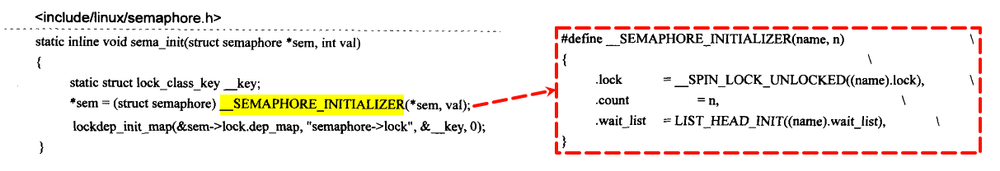

主要是为了将sem的lock值设置为解锁状态，count值设定为函数的调用参数val，同时初始化wait_list链表头。

### 4.2 DOWN操作

信号量的主要操作时DOWN和UP，在Linux内核中对信号量的DOWN操作有：

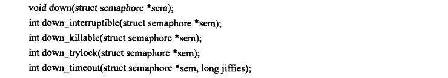

驱动程序中，使用最频繁的函数是down_interruptible函数，主要的实现如下：

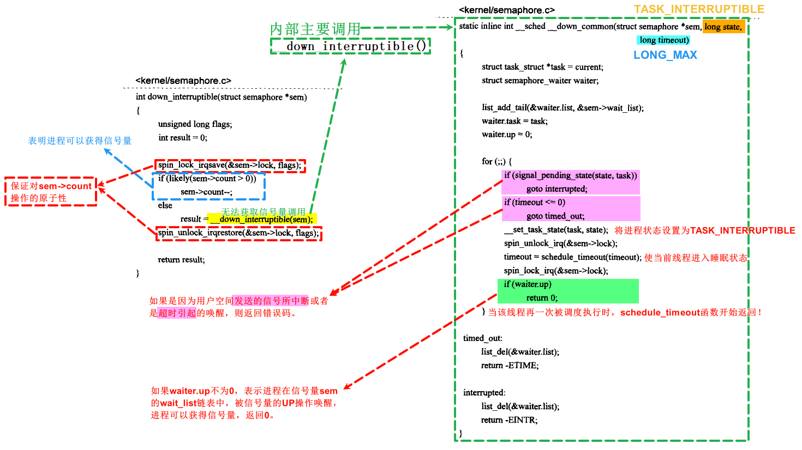

函数首先通过对spin_lock_irqsave的调用来保证对sem->count操作的原子性，防止多个进程对sem->count同时操作可能引起的混乱。如果代码成功进入临界区，则判断sem->count是否大于0：如果count大于0，表明当前进程可以获得信号量，就将count值减1，然后退出；如果count不大于0，表明当前进程无法获得该信号量，此时调用\_\_down_interruptible，由后者完成一个进程无法获得信号量时的操作，在内部调用\_\_down_common(structsemaphore*sem,long state,long timeout)，调用时的参数 `state=TASK_INTERRUPTIBLE, timeout=LONG_MAX`。所以当一个进程无法获得信号量时，最终调用的函数为\_\_down_common:

\_\_down_common函数的功能是，首先通过对一个struct semaphore_waiter变量waiter的使用，把当前进程放到信号量sem的成员变量wait_list所管理的队列中，接着在一个for循环中把当前进程的状态设置为TASK_INTERRUPTIBLE，再调用schedule_timeout使当前进程进入睡眠状态，函数将停留在schedule_timeout调用上，直到再次被调度执行。当该进程再一次被调度执行时，schedule_timeout开始返回，接下来根据进程被再次调度的原因进行处理：如果waiter.up不为0，说明进程在信号量sem的wati_list队列中被该信号量的UP操作所唤醒，进程可以获得信号量，返回0。如果进程是因为被用户空间发送的信号所中断或者是超时引起的唤醒，则返回相应的错误代码。因此对down_interruptible的调用总是应该坚持检查其返回值，以确定函数是已经获得了信号量还是因为操作被中断因而需要特别处理，通常驱动程序对返回的非O值要做的工作是返回-ERESTARTSYS5，比如下面的代码段：

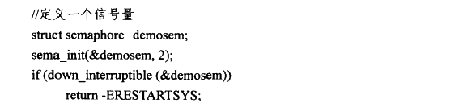

然而对down_interruptible函数的调用最常见的还是返回0表明调用者获得了信号量。

为了让讨论具体化，下面以一个例子来说明，假设一个信号量sem的count=2，说明允许有两个进程进入临界区，假设有进程A、B、C、D和E先后调用down_interruptible来获得信号量，那么进程A和B将得到信号量进入临界区，C、D和E将睡眠在sem的wait_list中，此时的情形如下图所示：

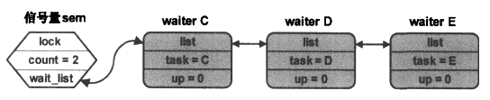


与down_interruptible函数的相比，down函数是不可中断的，这就意味着调用它的进程如果无法获取信号量，将一直处于睡眠状态直到有别的进程释放了该信号量，从用户空间的角度，如果应用程序阻塞在了驱动程序的down函数中，将无法通过一些强制措施比如按下Ctrl+D组合键来结束该进程，因此，除非必要，否者驱动程序中应避免使用down函数。


睡眠中的进程可以因受到一些致命性的信号(fatal signal)被唤醒而导致获取信号量的操作被中断，在驱动程序中很少使用。


进程试图获得信号量，但是如果无法获得信号量则直接返回1，而不是进入睡眠状态，返回0意味着函数的调用者已经获得了信号量。


函数在无法获取到信号量的情况下将进入睡眠状态，但是处于这种状态有时间限制，如果jiffies指明的时间到期仍然无法获取到信号量，则返回错误码-ETIME，在到期前进程的睡眠状态为TASK_UNINTERRUPTIBLE。成功获取信号量的函数返回0。

### 4.3 UP操作

Linux下只有一个UP函数：

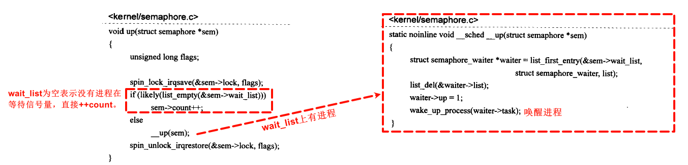

下面在前面图上的基础上讨论此处的操作。\_\_up函数首先用list_first_entry取得sem->wait_list链表上的第-一个waiter节点C，然后将其从sem->wait_list链表中删除，waiter->up=1，最后调用wake_up_process 来唤醒waiter C上的进程C。这样进程C将从之前down_interruptible调用中的timeout=schedule_timeout(timeout)处醒来，waiter->up=1，down_interruptible返回0，进程C获得信号量，进程D和E继续等待直到有进程释放信号量或者被用户空间中断掉。

即使不是信号量的拥有者，也可以调用up函数来释放一个信号量，这与下面将会讨论到的互斥锁是不相同的。

在Linux系统中，信号量的一个常用的用途是实现互斥机制，这种情况下信号量的值是1，也就是说任意时刻只允许一个进程进入临界区，为此Linux内核源码提供了一个宏定义DECLARE_MUTEX。专门用于这种用途的信号量的定义和初始化。


该宏定义了一个count=1的信号量name，并且初始化了相关成员。所以接下来就可以使用信号量的DOWN和UP操作来实现互斥，比如下面的这段代码：

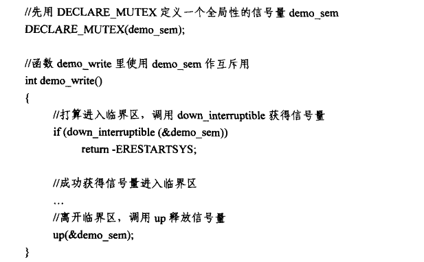

### 4.4 读取者和写入者信号量rwsem

如同spinlock一样，如果对操作共享资源的访问类型进行细分，在普通信号量的基础上可以实现读取者与写入者信号量。这里的概念完全等同于读取者与写入者自旋锁，所以下面将不再仔细讨论读取者与写入者信号量的实现机制。

读取者与写入者信号量的定义如下：

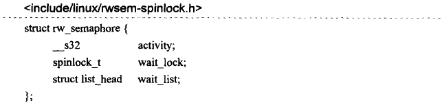

其中activity的含义为：

- activity=0：表明当前在该信号量上没有任何的读取者或者写入者。
- activity=-1：表明当前在该信号量上有一个活动的写入者。
- activity=n(>0)：表明当前信号量上有n个活动的读取者。

静态定义一个rwsem变量同时使用DECLEAR_RESEM宏进行初始化。

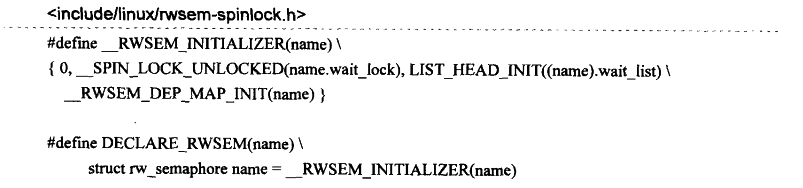

对一个rwsem变量的动态初始化使用init_rwsem宏，展开形式为：

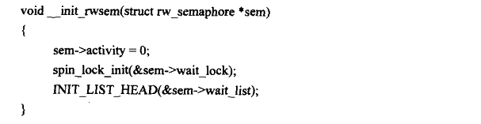

rw的初始状态是没有任何活动的读取者与写入者。

读取者的DOWN操作：


读取者的UP操作：


写入者的DOWN操作：


写入者的UP操作：


## 5 互斥锁

互斥锁mutex的概念本来就来自semaphore，如果去除掉那些跟调试相关的成员，structmutex和structsemaphore并没有本质的不同：


如同struct semaphore一样，对struct mutex的初始化不能直接通过操作其成员变量的方式进行，而应该利用内核提供的宏或者函数。

定义一个静态的struct mutex变量同时初始化的方法是利用内核的DEFINE_MUTEX：

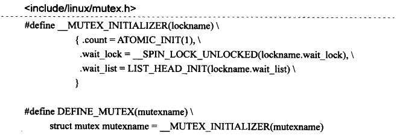

如果在程序执行期间要初始化一个mutex变量，则可以使用mutex_init宏。去除掉那些与调试相关的操作之后，mutex_init宏可以展开成如下的函数定义形式：

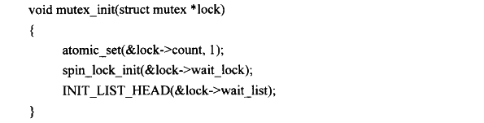

### 5.2 互斥锁的DOWN操作

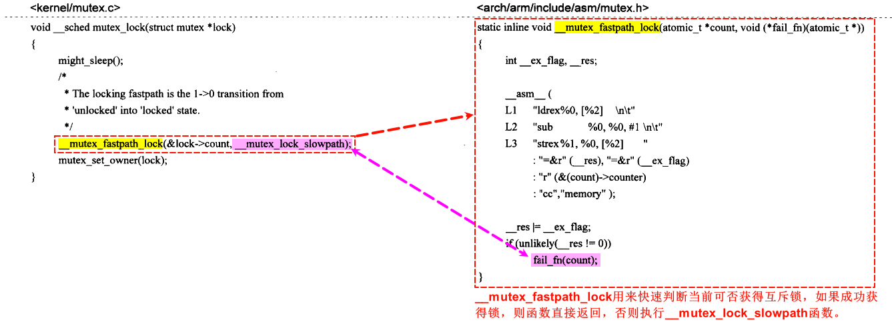

函数在L1 处通过 ldrex 完成\_\_res = count->counter，L2 处完成\_\_res=\_\_res-1，L3 处试图用\_\_res的当前值来更新count->counter。这里说“试图”是因为这个更新的操作未必会成功，主要是考虑到可能有别的进程也在操作count->counter，为不使这种可能的竞争引l起对count->counter值更新的混乱，这里用了ARM指令中用于实现互斥访问的指令ldrex和strex（前面在spinlock的代码分析时已经提过）。Idrex和strex保证了对count->counter的“读取一-更新一写回”操作序列的原子性。如果L3处的更新操作成功，那么\_\_ex_flag将为0。

接下来在\_\_res=\_\_ex_flag 执行完之后，通过if语句判断\_\_res是否为0，有两种情况会导致\_\_res不为0：一是在调用这个函数前count->counter-0，表明互斥锁已经被别的进程获得，这样L2处的\_\_res=-1；二是在L3处的更新操作不成功，表明当前有另外一个进程也在对count->counter进行同样的操作。这两种情况都将导致\_\_mutex_fastpath_lock不能直接返回，而是进入fail_fn，也就是调用\_\_mutex_lock_slowpath。

此处if语句中的unlikely是利用GCC编译优化扩展的一个宏，这里的意思是条件语句\_\_res !=0为真的可能性很小，编译器借此可以调整一些编译后代码的顺序达到某种程度的优化。与之对应的是likely。

如果\_\_mutex_fastpath_lock函数不能在第一时间获得互斥锁返回，那么将进入\_\_mutex_lock_slowpath，正如其名字所预示的那样，代码将进入一段艰难坎坷的旅途。

在Linux源码中，\_\_mutex_lock_slowpath函数与信号量DOwN操作中的down函数非常相似，不过\_\_mutex_lock_slowpath在把当前进程放入mutex的wait_list之前会试图多次询问mutex中的count是否为1，也就是说当前进程在进入wait_list之前会多次考察别的进程是否已经释放了这个互斥锁。这主要基于这样一个事实：拥有互斥锁的进程总是会在尽可能短的时间里释放。如果别的进程已经释放了该互斥锁，那么当前进程将可以获得该互斥锁而没有必要再去睡眠。

### 5.3 互斥锁的UP操作

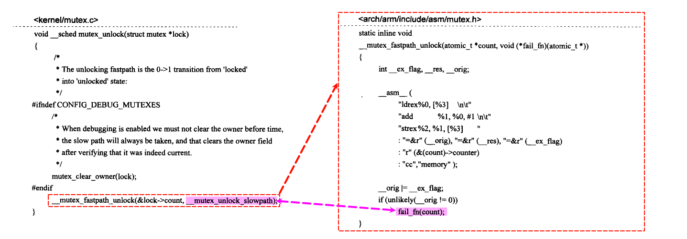

这里除了是将count->counter的值加1以外，代码和\_\_mutex_fastpath_lock中的几乎完全一样。在最后的if语句中，导致代码中_orig不为0也有两种情况：一是在调用这个函数前count->counter不为0，表明在当前进程占有互斥锁期间有别的进程竞争该互斥锁；二是对count->counter的更新操作不成功，表明当前有另外一个进程也在对count->counter进行操作，这种情况主要是针对别的进程此时调用mutex_lock函数导致的竞争，因为互斥的原因别的进程此时不可能调用mutex_unlock。这种情况的处理是非常重要的，不只是关系到count->counter正确更新的问题，还涉及能否防止一个唤醒操作的丢失。

在没有别的进程竞争该互斥锁的情况下，\_\_mutex_fastpath_unlock函数要完成的工作最简单，把count->counter的值加1然后返回。如果有别的进程在竞争该互斥锁，那么函数进入\_\_mutex_unlock_slowpath，这个函数主要用来唤醒在当前mutex的wait_list中休眠的进程，如同up 函数一样。

## 6 顺序锁seqlock

