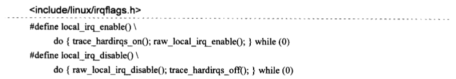

# 互斥与同步

## 1 并发的来源

### 1.1 中断处理路径

当系统正在执行当前当前进程时，发生了中断，中断函数和被中断的进程之间形成的并发，在单处理器中，虽然中断处理函数的执行路径和被中断的进程之间不是真正严格意义上的并发，然而中断处理函数和被中断进程之间可能成为竞态。软中断的执行也可归结到这类并发中。

### 1.2 调度器的可抢占性

在单处理器上，因为调度器的可抢占特性，导致的进程与进程之间的并发，这种行为非常类似多处理器系统上进程间的并发。

### 1.3 多处理器的并发执行

多处理器系统上进程与进程之间是严格意义上的并发，每个处理器可独自调度一个进程，在同一时刻有多个进程在同时运行。

## 2 local_irq_enable与local_irq_disable

在单处理器不可抢占系统中，local_irq_enable(打开本地处理器的中断)与local_irq_disable(关闭本地处理器的中断)是消除异步并发源的有效方式。



```c
local_irq_disable() // 关闭处理器中断
/* 访问共享资源 */
.....
local_irq_enable() // 打开处理器中断
```

在单处理器不可抢占系统中，使用local_irq_enable与local_irq_disable来对共享数据保护是种简单有效的方法。

> 注意：
>
> 因为这两个函数是通过关中断的方式进行互斥保护，所以必须保证处于两者之间的代码执行时间不能太长，否者将影响到系统的性能。

