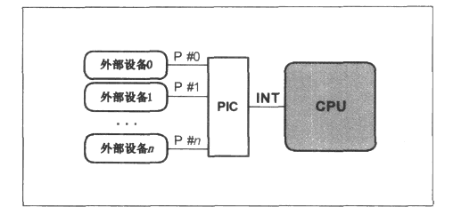
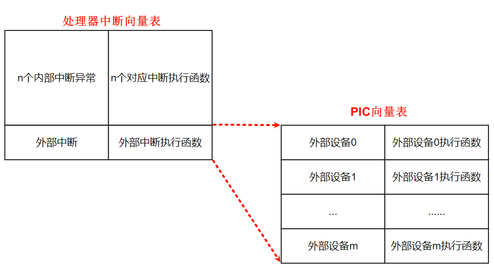
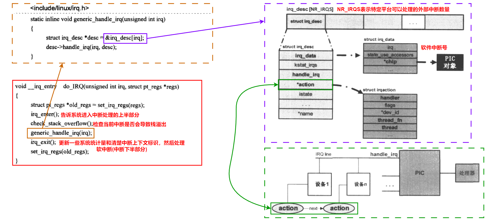
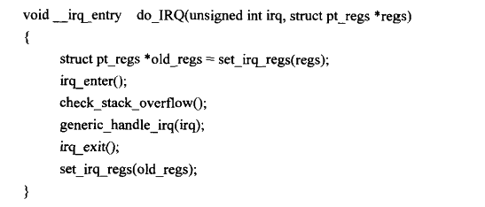
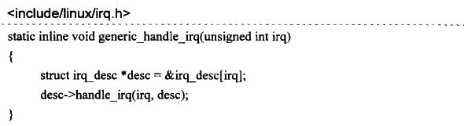
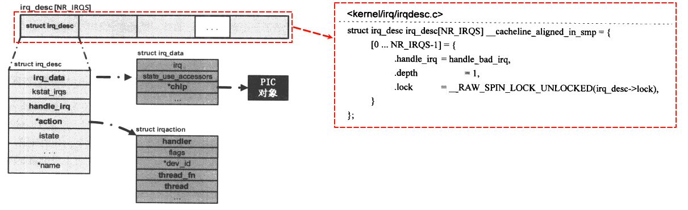
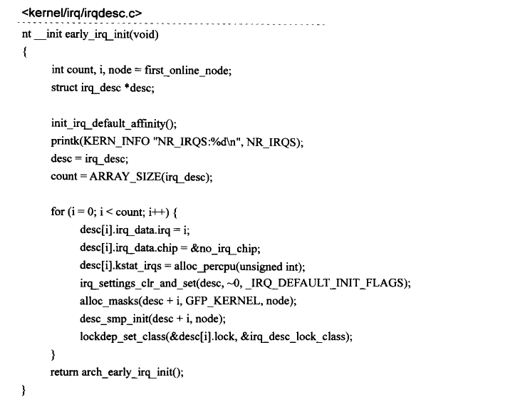
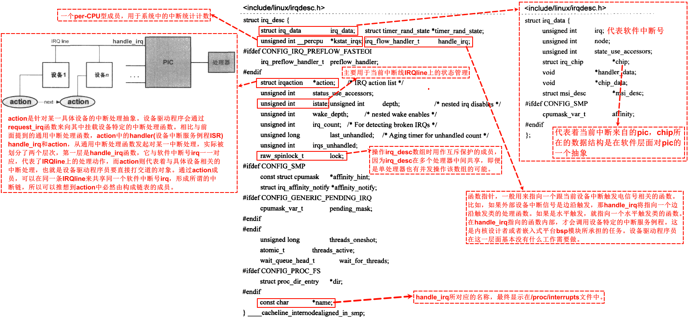
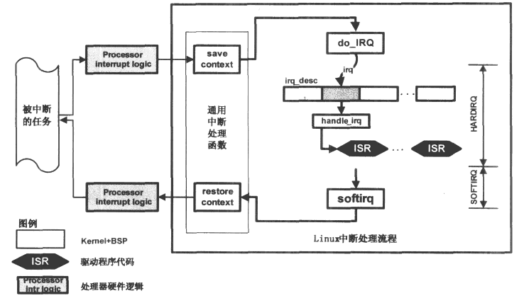
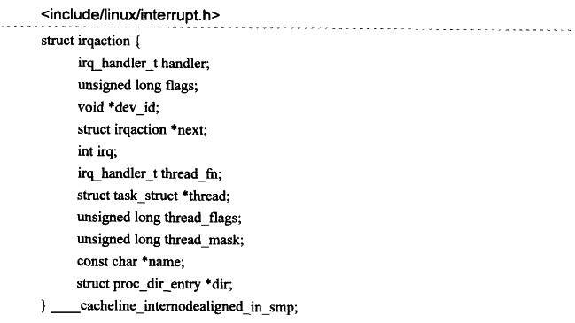

# 中断处理(未完成)

外部设备与中央处理器交互一般有两种手段：轮询和中断。对于轮询，要求处理器不停地查询外设的状态，在此期间处理器不能做别的事情。而中断不要求处理器不停地查询自己的状态，而是在自己的状态满足处理器的要求时主动发送一个硬件信号给处理器，后者在接收到这一信号时，会挂起当前正在执行的任务转而去处理外设的中断信号。

现代设备绝大多数采用中断的方式与处理器进行沟通，因此设备驱动程序必须能够支持设备的中断特性。处理器在中断到达时会根据不同的中断号找到对应的处理函数对该信号进行处理，这些处理函数称为中断处理例程ISR(Interrupt Service Routine)，设备驱动程序负责为管理的设备提供中断处理例程并向系统注册。从设备发出中断信号，到处理器最终调用中断处理例程进行处理，期间会经过很多步骤，这个过程构成了中断处理框架。不同的操作系统对中断处理框架的设计不尽相同，但是要达到的目的是一样的，那就是最终调用设备的中断处理例程。

## 1 中断的硬件框架

处理器一般只有两根左右的中断引脚，而管理的外设却很多。为了解决这个问题，现代设备的中断信号线并不是与处理器直接相连，而是与一个称为中断控制器的设备相连接，后者才跟处理器的中断引脚直接连接。中断控制器一般可以通过处理器进行编程配置，所以常称为可编程中断控制器PIC(ProgrammableInterruptController)。下图是一个典型的中断硬件连接的系统框架图：

图中，PIC的输出中断信号线连接到处理器的INT引I脚上，这是处理器专门用来接收中断信号的pin脚。外部设备的中断线连接到PIC的pin引I脚上，这是PIC用来接收外设中断的pin脚，比如外部设备1的中断线通过P0连到PIC上。在实际的硬件平台上，PIC有的在CPU外部，比如x86平台上的8259控制器；有的被封装到了CPU的内部，这广泛见于嵌入式领域，一颗SoC芯片内部集成了处理器和各种外部设备的控制器，其中包括PIC。中断方面的内容常常涉及硬件平台的差别，但是这里不会纠结于某个具体的硬件设计，而是希望相关的内容可以很快被读者吸纳到自己手边的平台上。为了让讨论更加方便，下面把图中中断的连接逻辑作为通用的硬件平台。

> [!NOTE]
>
> NVIC和PIC都是可编程控制器，但它们有一些关键的区别和关系。
>
> NVIC，嵌套向量中断控制器，是ARM Cortex-M内核的一部分，主要用于管理异常和中断。在Cortex-M内核中，NVIC管理包括内核、外部异常等的所有中断的响应和处理。NVIC有一些可编程寄存器，这些寄存器被映射到系统地址空间里，被称为系统控制空间(SCS)。NVIC具有灵活的中断管理、支持嵌套中断、向量化的异常入口、中断屏蔽等功能。
>
> PIC，可编程中断控制器，是一种用来统一管理硬件中断的设备。典型代表是Intel的8259A。PIC包含一些寄存器，如中断请求寄存器(IRR)、中断屏蔽寄存器(IMR)和正在服务寄存器(ISR)。PIC在正常工作前需要设置初始化命令字寄存器，在工作过程中可以写入操作命令字寄存器来随时设置和管理工作方式。
>
> 总结来说，NVIC和PIC都是用于管理中断的硬件设备，但NVIC主要集成在微处理器中，用于管理异常和中断，而PIC是一个独立的设备，用于统一管理硬件中断。在实际应用中，根据具体需求选择使用NVIC还是PIC。

## 2 PIC和软件中断号

实际使用中，在处理器能处理外部设备的中断前，常常需要对PIC进行配置，配置工作常常作为操作系统初始化任务的一部分。当然中断处理框架也需要提供适当的PIC配置接口函数供设备驱动程序调用，因为设备驱动所管理的设备也许并不是一开始就连接到PIC的某一中断引脚上的。如果在系统运行起来之后，某一外设才被用户接入系统，那么它的驱动程序应该负责配置PIC的对应引脚，使该外设能正常中断处理器。对PIC的配置工作主要包括：

- 设定外部设备中断触发电信号的类型，常见的触发类型有水平触发和边沿触发。
- 将外设的中断引脚编号映射到处理器可见的软件中断号irq。
- 屏蔽掉某些外部设备的中断触发。

> [!NOTE]
>
> 屏蔽一个中断有两层含义：
>
> - 一是指在处理器内部的中断屏蔽，这种情况下处理器不会响应外部中断信号。
> - 二是指在PIC层面的屏蔽，此时屏蔽只针对某个PIC中断引脚信号。

为了让处理器可以配置自己，PIC常常需要提供一系列的控制寄存器。这些控制寄存器可以完成上述所有配置工作，并且配置粒度可以细分到PIC的每一个中断输入引脚P。此处一个需要明确定义的概念是软件中断号irq，它是发生设备中断时处理器从PIC中读到的中断号码，在操作系统建立的中断处理框架内，会使用这个irg号来标识一个外设的中断并调用对应的中断处理例程。

作为描述的示例，考虑上图中外部设备0触发的一个中断电信号被处理的大体流程。PIC将首先接收到该信号，如果它没有被屏蔽，那么PIC应该在INT引脚上产生一个中断信号告诉处理器。后者在接收到该信号后会从PIC那里得到一个特定的标识号码，该号码告诉中断处理框架，是设备0发生了中断。于是中断处理框架会调用设备0的中断处理例程，此处的这个特定的标识设备0的中断号码就称为软件中断号irq或者中断号irq。

此处还有一个概念需要提一下，那就是中断向量表(vectortable)。这其实是处理器内部的一个概念，因为处理器除了会被外部设备中断，其内部也可能会产生异常等事件。当这些事发生时，CPU必须暂停当前的工作，转而去处理中断或者异常，因此处理器需要知道到哪里去获得这些中断或异常的处理函数的目标地址。中断向量表就用来解决这个问题，其每一项都是一个中断或异常处理函数的入口地址。外部设备的中断常常对应向量表中的某一项，这是个通用的外部中断处理函数的入口，因此在进入通用的中断处理函数之后，系统必须要知道正在处理的中断是哪一个设备产生的，而这正是由前面提到的软件中断号irq决定的。中断向量表中的内容由操作系统在初始化阶段来填写，**对于外部中断，操作系统负责实现一个通用的外部中断处理函数**，然后把这个函数的入口地址放到中断向量表中的对应位置。

## 3 通用的中断处理函数

当有外部中断发生时，预先设计好的处理器硬件逻辑往往会做一些特定的动作，为从软件层面发起的中断处理做准备工作。不同的处理器有不同的逻辑设计，但这些动作常常包括**把当前任务的上下文寄存器保存在一个特定的中断栈中，屏蔽掉处理器响应外部中断的能力**等。在这些动作的结束部分，硬件逻辑根据中断向量表中的外部中断对应的入口地址，开始调用由操作系统提供的通用中断处理函数。

不同的架构平台上通用中断处理函数的实现也不尽相同，但在开始部分，都会设法从PIC中得到导致本次中断发生的外部设备对应的软件中断号irq，这部分代码通常都是用汇编语言实现，在Linux源码树中散落在各个特定架构对应的目录中。然后通用处理函数开始调用一个C函数，大部分平台上这个C函数的名字是do_IRQ，但也有例外，比如ARM平台上是asm_do_IRQ，本文采用**do_IRQ**来指代该C函数的名称。

中断处理的绝大部分流程都浓缩在了这个C函数当中，当这个函数返回时，通用中断处理函数余下部分的代码将完成中断现场恢复的工作，这也标志着整个中断处理流程的结束，被中断的任务开始继续执行，仿佛没发生过一样。

通常，处理器在接收到外部的中断信号时，硬件逻辑会自动屏蔽处理器响应外部中断的能力，因此如果操作系统实现的中断处理框架不主动打开中断的话，整个中断处理的流程是在中断关闭的情况下进行的。因为各个设备的中断处理函数一般是由驱动程序实现的，内核无法保证这些中断处理函数执行时间的长短，如果某一中断处理函数执行时间过长，则将会导致系统可能很长时间无法接收中断，这可能会使某些外部设备丢失数据或者操作系统响应时间变长等。为了解决这一问题，Linux内核为驱动程序提供的中断处理机制分成了两个部分：HARDIRQ和SOFTIRQ。前者是在中断关闭的情况下执行，用来完成中断发生后最关键的操作，它的执行时间应该尽可能短。后者是在中断开启的情况下进行，此时外部设备仍可以继续中断处理器，驱动程序因此可以将一些比较耗时的工作延迟到这部分执行。在do_IRQ函数中，对irq_enter的调用可以认为是HARDIRQ部分的开始，而SOFTIRQ则在irgexit中完成。

## 4 do_IRQ函数

do_IRQ函数从通用中断处理函数中发起，负责整个中断处理流程中实质性的中断处理任务。虽然该函数在各个平台上的实现代码不尽相同，但是原理基本上大同小异，一个典型的实现如下：

先看该函数的两个参数，irq是该函数的调用者(通用中断处理函数)从PIC中得到的软件中断号，regs是保存下来的被中断任务的执行现场，不同的处理器有不同的执行现场，也就是有不同的寄存器。

函数首先调用set_irq_regs将一个per-CPU型的指针变量\_\_irq_regs保存到old_regs中，然后将\_\_irq_regs赋予了一个新值regs，这样中断处理过程中，系统中的每一个CPU都可以通过\_\_irq_regs 来访问系统保存的中断现场。在函数的结束，调用 set_irq_regs(old_regs)来恢复\_\_irq_regs。\_\_irq_regs一般用来在调试或者诊断时打印当前栈的信息，也可以通过这些保存的中断现场寄存器判断出被中断的进程当时运行在用户态还是内核态。

接下来irq_enter会更新系统中的一些统计量，同时会把当前栈中的preempt_count变量加上HARDIRQ_OFFSET来标识一个HARDIRQ中断上下文：preempt_countO+HARDIRQ_OFFSET，HARDIRQ是Linux下对中断处理上半部分的称谓，与之对应的是中断处理的下半部分SOFTIRQ，此处irq_enter告诉系统现在进入了中断处理的上半部分。与irq_enter行为配对的是irq_exit，在当前中断处理完成准备退出时调用，除了更新一些系统统计量和清除中断上下文的标识外，它还有一个重要的功能是处理软中断，也就是中断处理的下半部分，本文将在“延迟操作”一章详细讨论软中断的实现机制。

check_stack_overflow()函数用来检查当前中断是否会导致栈的溢出，因为每次中断发生时系统都会做保护现场的动作，从代码的层面，就是将系统的寄存器压入中断栈中。理想情况下，一个中断处理结束时将恢复现场，也就是将之前在栈中保存的寄存器弹出堆栈，因此不会发生栈溢出的情况。但是如果中断处理函数中打开了处理器响应外部中断的能力，那就有可能在当前中断正在被处理时，处理器又接收到了新的中断，也就是所谓的中断嵌套，这将导致系统重复地进行中断现场保护的动作，甚至发生大量的中断嵌套行为，使得栈不断增长，从而出现堆栈的溢出，影响到系统的稳定性。为此，系统使用check_stack_overflow函数来对栈是否溢出进行检查，如果发现本次中断有可能导致栈的溢出，通常会打印出当前栈的信息(dump_stack)，对于某些启用了watchdog的系统，也可能会强制系统进行reset动作。

do_IRQ的核心是调用generic_handle_irq函数，后者在其函数调度链中负责对当前发生的中断进行实际的处理：

函数通过软件中断号irq来索引数组irq_desc，得到一个structirq_desc类型的指针变量desc，然后调用其成员函数handle_irq对当前中断进行实际的处理。irq_desc是个structirq_desc类型的数组，在Limux的整个中断处理框架中非常重要，起着沟通从通用的中断处理函数到设备特定的中断处理例程之间的桥梁作用，下图展示了该数组的组成结构：

NR_IRQS是个平台相关的常量，用来表示特定的平台上可以处理的外部中断的数量。Linux操作系统初始化期间通过调用early_irq_init函数来对这个数组初始化：

数组的类型structirq_desc是个非常重要的数据结构，在下面的讨论中会经常用到。定义如下：

结合上述描述，给出中断流程图：

从图中可以看到，Linux内核将中断的处理分成了两大部分，分别是HARDIRQ和SOFTIRQ，前者一般是在处理器屏蔽外部中断的情况下工作，而后者在工作前会启用处理器响应外部中断的能力。通用中断处理函数是外部设备的中断到达处理器后，处理器首先进入的函数，在完成必要的工作后，调用do_IRQ来对中断进行实际的处理。后者通过引发本次中断的软件中断号来索引irq_desc数组，找到对应的处理函数并调用，而设备驱动程序等内核模块则通过修改irq_desc数组中对应项的action成员来达到安装或卸载设备中断处理服务例程ISR的目的。设备的中断处理函数调用结束后，中断流程进入SOFTIRQ部分，在这里如果有等待的softirg需要处理，则处理之，否则返回到通用中断处理函数。

## 5 struct irq_chip

数据结构structirq_data中的structirq_chip*chip成员用来表示一个PIC的对象，如果系统中只有一个PIC，那么irq_desc数组的每一项中的chip都应该指向该PIC的对象。平台的初始化函数负责实现该平台使用的PIC的对象并将其安装到irq_desc数组中。PIC对象用来实现对PIC的配置，配置工作主要包括设定外部设备的中断触发信号的类型，屏蔽或者启用某一设备的中断信号，向发出中断请求的设备发送中断响应信号等。structirq_chip 定义如下：

其成员绝大多数是函数指针，用来指向具体平台实现的PIC控制函数。

## 6 struct irqaction

在继续下面的讨论前，有必要了解structirqaction这个重要的数据结构。在structirq_desc结构中，成员变量action是一指向structirqaction类型的指针，设备驱动程序通过这个结构将其中断处理函数挂载在action上。以下是该数据结构的定义：

| **成员**                        | **描述**                                                     |
| ------------------------------- | ------------------------------------------------------------ |
| handler                         | 指向设备特定的中断服务例程函数的指针，设备驱动程序调用request_irq函数，把驱动程序实现的中断服务例程赋值给handler。 |
| dev_id                          | 调用handler时传给它的参数，在多个设备共享一个irq的情况下特别重要，这种链式的action中，设备驱动程序通过dev_id来标识自己。 |
| next                            | 指向下一-个action对象，用于多个设备共享同一个irq的情形，此时action通过next构成一个链表。 |
| dir                             | 中断处理函数中用来创建在proc文件系统中的目录项。             |
| thread_fn、thread、thread_flags | 当驱动程序调用request_threaded_irq函数来安装中断处理例程时，用来实现irq_thread机制。 |

## 7 irq_set_handler

