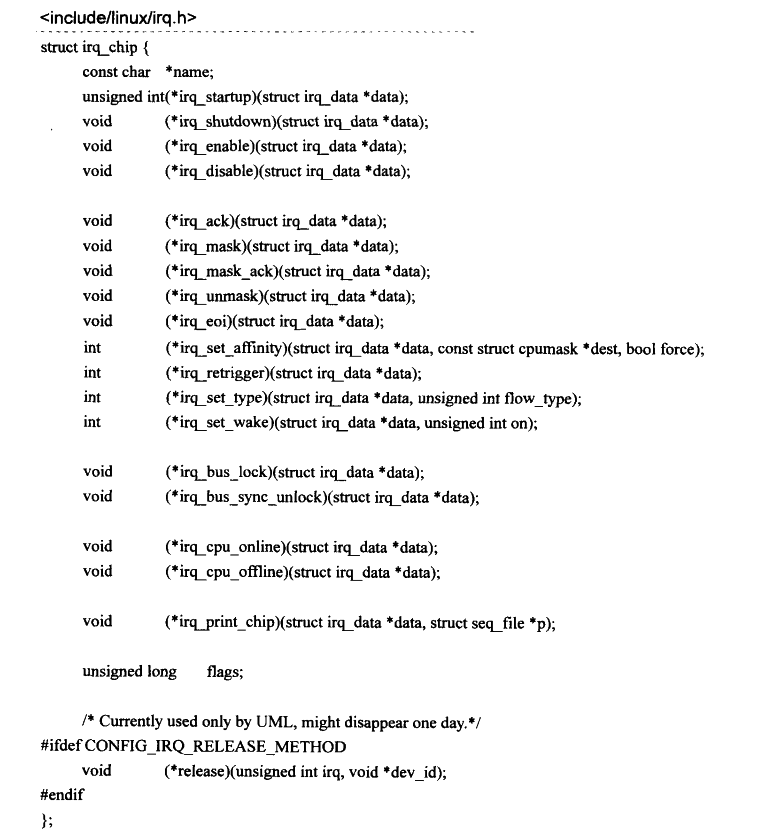

# 中断处理(未完成)

外部设备与中央处理器交互一般有两种手段：轮询和中断。对于轮询，要求处理器不停地查询外设的状态，在此期间处理器不能做别的事情。而中断不要求处理器不停地查询自己的状态，而是在自己的状态满足处理器的要求时主动发送一个硬件信号给处理器，后者在接收到这一信号时，会挂起当前正在执行的任务转而去处理外设的中断信号。

现代设备绝大多数采用中断的方式与处理器进行沟通，因此设备驱动程序必须能够支持设备的中断特性。处理器在中断到达时会根据不同的中断号找到对应的处理函数对该信号进行处理，这些处理函数称为中断处理例程ISR(Interrupt Service Routine)，设备驱动程序负责为管理的设备提供中断处理例程并向系统注册。从设备发出中断信号，到处理器最终调用中断处理例程进行处理，期间会经过很多步骤，这个过程构成了中断处理框架。不同的操作系统对中断处理框架的设计不尽相同，但是要达到的目的是一样的，那就是最终调用设备的中断处理例程。

## 1 中断的硬件框架

处理器一般只有两根左右的中断引脚，而管理的外设却很多。为了解决这个问题，现代设备的中断信号线并不是与处理器直接相连，而是与一个称为中断控制器的设备相连接，后者才跟处理器的中断引脚直接连接。中断控制器一般可以通过处理器进行编程配置，所以常称为可编程中断控制器PIC(ProgrammableInterruptController)。下图是一个典型的中断硬件连接的系统框架图：


图中，PIC的输出中断信号线连接到处理器的INT引I脚上，这是处理器专门用来接收中断信号的pin脚。外部设备的中断线连接到PIC的pin引I脚上，这是PIC用来接收外设中断的pin脚，比如外部设备1的中断线通过P0连到PIC上。在实际的硬件平台上，PIC有的在CPU外部，比如x86平台上的8259控制器；有的被封装到了CPU的内部，这广泛见于嵌入式领域，一颗SoC芯片内部集成了处理器和各种外部设备的控制器，其中包括PIC。中断方面的内容常常涉及硬件平台的差别，但是这里不会纠结于某个具体的硬件设计，而是希望相关的内容可以很快被读者吸纳到自己手边的平台上。为了让讨论更加方便，下面把图中中断的连接逻辑作为通用的硬件平台。

> [!NOTE]
>
> NVIC和PIC都是可编程控制器，但它们有一些关键的区别和关系。
>
> NVIC，嵌套向量中断控制器，是ARM Cortex-M内核的一部分，主要用于管理异常和中断。在Cortex-M内核中，NVIC管理包括内核、外部异常等的所有中断的响应和处理。NVIC有一些可编程寄存器，这些寄存器被映射到系统地址空间里，被称为系统控制空间(SCS)。NVIC具有灵活的中断管理、支持嵌套中断、向量化的异常入口、中断屏蔽等功能。
>
> PIC，可编程中断控制器，是一种用来统一管理硬件中断的设备。典型代表是Intel的8259A。PIC包含一些寄存器，如中断请求寄存器(IRR)、中断屏蔽寄存器(IMR)和正在服务寄存器(ISR)。PIC在正常工作前需要设置初始化命令字寄存器，在工作过程中可以写入操作命令字寄存器来随时设置和管理工作方式。
>
> 总结来说，NVIC和PIC都是用于管理中断的硬件设备，但NVIC主要集成在微处理器中，用于管理异常和中断，而PIC是一个独立的设备，用于统一管理硬件中断。在实际应用中，根据具体需求选择使用NVIC还是PIC。

## 2 PIC和软件中断号

实际使用中，在处理器能处理外部设备的中断前，常常需要对PIC进行配置，配置工作常常作为操作系统初始化任务的一部分。当然中断处理框架也需要提供适当的PIC配置接口函数供设备驱动程序调用，因为设备驱动所管理的设备也许并不是一开始就连接到PIC的某一中断引脚上的。如果在系统运行起来之后，某一外设才被用户接入系统，那么它的驱动程序应该负责配置PIC的对应引脚，使该外设能正常中断处理器。对PIC的配置工作主要包括：

- 设定外部设备中断触发电信号的类型，常见的触发类型有水平触发和边沿触发。
- 将外设的中断引脚编号映射到处理器可见的软件中断号irq。
- 屏蔽掉某些外部设备的中断触发。

> [!NOTE]
>
> 屏蔽一个中断有两层含义：
>
> - 一是指在处理器内部的中断屏蔽，这种情况下处理器不会响应外部中断信号。
> - 二是指在PIC层面的屏蔽，此时屏蔽只针对某个PIC中断引脚信号。

为了让处理器可以配置自己，PIC常常需要提供一系列的控制寄存器。这些控制寄存器可以完成上述所有配置工作，并且配置粒度可以细分到PIC的每一个中断输入引脚P。此处一个需要明确定义的概念是软件中断号irq，它是发生设备中断时处理器从PIC中读到的中断号码，在操作系统建立的中断处理框架内，会使用这个irg号来标识一个外设的中断并调用对应的中断处理例程。

作为描述的示例，考虑上图中外部设备0触发的一个中断电信号被处理的大体流程。PIC将首先接收到该信号，如果它没有被屏蔽，那么PIC应该在INT引脚上产生一个中断信号告诉处理器。后者在接收到该信号后会从PIC那里得到一个特定的标识号码，该号码告诉中断处理框架，是设备0发生了中断。于是中断处理框架会调用设备0的中断处理例程，此处的这个特定的标识设备0的中断号码就称为软件中断号irq或者中断号irq。

此处还有一个概念需要提一下，那就是中断向量表(vectortable)。这其实是处理器内部的一个概念，因为处理器除了会被外部设备中断，其内部也可能会产生异常等事件。当这些事发生时，CPU必须暂停当前的工作，转而去处理中断或者异常，因此处理器需要知道到哪里去获得这些中断或异常的处理函数的目标地址。中断向量表就用来解决这个问题，其每一项都是一个中断或异常处理函数的入口地址。外部设备的中断常常对应向量表中的某一项，这是个通用的外部中断处理函数的入口，因此在进入通用的中断处理函数之后，系统必须要知道正在处理的中断是哪一个设备产生的，而这正是由前面提到的软件中断号irq决定的。中断向量表中的内容由操作系统在初始化阶段来填写，**对于外部中断，操作系统负责实现一个通用的外部中断处理函数**，然后把这个函数的入口地址放到中断向量表中的对应位置。


## 3 通用的中断处理函数

当有外部中断发生时，预先设计好的处理器硬件逻辑往往会做一些特定的动作，为从软件层面发起的中断处理做准备工作。不同的处理器有不同的逻辑设计，但这些动作常常包括**把当前任务的上下文寄存器保存在一个特定的中断栈中，屏蔽掉处理器响应外部中断的能力**等。在这些动作的结束部分，硬件逻辑根据中断向量表中的外部中断对应的入口地址，开始调用由操作系统提供的通用中断处理函数。

不同的架构平台上通用中断处理函数的实现也不尽相同，但在开始部分，都会设法从PIC中得到导致本次中断发生的外部设备对应的软件中断号irq，这部分代码通常都是用汇编语言实现，在Linux源码树中散落在各个特定架构对应的目录中。然后通用处理函数开始调用一个C函数，大部分平台上这个C函数的名字是do_IRQ，但也有例外，比如ARM平台上是asm_do_IRQ，本文采用**do_IRQ**来指代该C函数的名称。

中断处理的绝大部分流程都浓缩在了这个C函数当中，当这个函数返回时，通用中断处理函数余下部分的代码将完成中断现场恢复的工作，这也标志着整个中断处理流程的结束，被中断的任务开始继续执行，仿佛没发生过一样。

通常，处理器在接收到外部的中断信号时，硬件逻辑会自动屏蔽处理器响应外部中断的能力，因此如果操作系统实现的中断处理框架不主动打开中断的话，整个中断处理的流程是在中断关闭的情况下进行的。因为各个设备的中断处理函数一般是由驱动程序实现的，内核无法保证这些中断处理函数执行时间的长短，如果某一中断处理函数执行时间过长，则将会导致系统可能很长时间无法接收中断，这可能会使某些外部设备丢失数据或者操作系统响应时间变长等。为了解决这一问题，Linux内核为驱动程序提供的中断处理机制分成了两个部分：HARDIRQ和SOFTIRQ。前者是在中断关闭的情况下执行，用来完成中断发生后最关键的操作，它的执行时间应该尽可能短。后者是在中断开启的情况下进行，此时外部设备仍可以继续中断处理器，驱动程序因此可以将一些比较耗时的工作延迟到这部分执行。在do_IRQ函数中，对irq_enter的调用可以认为是HARDIRQ部分的开始，而SOFTIRQ则在irgexit中完成。

## 4 do_IRQ函数


do_IRQ函数从通用中断处理函数中发起，负责整个中断处理流程中实质性的中断处理任务。虽然该函数在各个平台上的实现代码不尽相同，但是原理基本上大同小异，一个典型的实现如下：


先看该函数的两个参数，irq是该函数的调用者(通用中断处理函数)从PIC中得到的软件中断号，regs是保存下来的被中断任务的执行现场，不同的处理器有不同的执行现场，也就是有不同的寄存器。

函数首先调用set_irq_regs将一个per-CPU型的指针变量\_\_irq_regs保存到old_regs中，然后将\_\_irq_regs赋予了一个新值regs，这样中断处理过程中，系统中的每一个CPU都可以通过\_\_irq_regs 来访问系统保存的中断现场。在函数的结束，调用 set_irq_regs(old_regs)来恢复\_\_irq_regs。\_\_irq_regs一般用来在调试或者诊断时打印当前栈的信息，也可以通过这些保存的中断现场寄存器判断出被中断的进程当时运行在用户态还是内核态。

接下来irq_enter会更新系统中的一些统计量，同时会把当前栈中的preempt_count变量加上HARDIRQ_OFFSET来标识一个HARDIRQ中断上下文：preempt_countO+HARDIRQ_OFFSET，HARDIRQ是Linux下对中断处理上半部分的称谓，与之对应的是中断处理的下半部分SOFTIRQ，此处irq_enter告诉系统现在进入了中断处理的上半部分。与irq_enter行为配对的是irq_exit，在当前中断处理完成准备退出时调用，除了更新一些系统统计量和清除中断上下文的标识外，它还有一个重要的功能是处理软中断，也就是中断处理的下半部分，本文将在“延迟操作”一章详细讨论软中断的实现机制。

check_stack_overflow()函数用来检查当前中断是否会导致栈的溢出，因为每次中断发生时系统都会做保护现场的动作，从代码的层面，就是将系统的寄存器压入中断栈中。理想情况下，一个中断处理结束时将恢复现场，也就是将之前在栈中保存的寄存器弹出堆栈，因此不会发生栈溢出的情况。但是如果中断处理函数中打开了处理器响应外部中断的能力，那就有可能在当前中断正在被处理时，处理器又接收到了新的中断，也就是所谓的中断嵌套，这将导致系统重复地进行中断现场保护的动作，甚至发生大量的中断嵌套行为，使得栈不断增长，从而出现堆栈的溢出，影响到系统的稳定性。为此，系统使用check_stack_overflow函数来对栈是否溢出进行检查，如果发现本次中断有可能导致栈的溢出，通常会打印出当前栈的信息(dump_stack)，对于某些启用了watchdog的系统，也可能会强制系统进行reset动作。

do_IRQ的核心是调用generic_handle_irq函数，后者在其函数调度链中负责对当前发生的中断进行实际的处理：


函数通过软件中断号irq来索引数组irq_desc，得到一个structirq_desc类型的指针变量desc，然后调用其成员函数handle_irq对当前中断进行实际的处理。irq_desc是个structirq_desc类型的数组，在Limux的整个中断处理框架中非常重要，起着沟通从通用的中断处理函数到设备特定的中断处理例程之间的桥梁作用，下图展示了该数组的组成结构：


NR_IRQS是个平台相关的常量，用来表示特定的平台上可以处理的外部中断的数量。Linux操作系统初始化期间通过调用early_irq_init函数来对这个数组初始化：


数组的类型structirq_desc是个非常重要的数据结构，在下面的讨论中会经常用到。定义如下：


结合上述描述，给出中断流程图：


从图中可以看到，Linux内核将中断的处理分成了两大部分，分别是HARDIRQ和SOFTIRQ，前者一般是在处理器屏蔽外部中断的情况下工作，而后者在工作前会启用处理器响应外部中断的能力。通用中断处理函数是外部设备的中断到达处理器后，处理器首先进入的函数，在完成必要的工作后，调用do_IRQ来对中断进行实际的处理。后者通过引发本次中断的软件中断号来索引irq_desc数组，找到对应的处理函数并调用，而设备驱动程序等内核模块则通过修改irq_desc数组中对应项的action成员来达到安装或卸载设备中断处理服务例程ISR的目的。设备的中断处理函数调用结束后，中断流程进入SOFTIRQ部分，在这里如果有等待的softirg需要处理，则处理之，否则返回到通用中断处理函数。

## 5 struct irq_chip

数据结构structirq_data中的structirq_chip*chip成员用来表示一个PIC的对象，如果系统中只有一个PIC，那么irq_desc数组的每一项中的chip都应该指向该PIC的对象。平台的初始化函数负责实现该平台使用的PIC的对象并将其安装到irq_desc数组中。PIC对象用来实现对PIC的配置，配置工作主要包括设定外部设备的中断触发信号的类型，屏蔽或者启用某一设备的中断信号，向发出中断请求的设备发送中断响应信号等。structirq_chip 定义如下：



其成员绝大多数是函数指针，用来指向具体平台实现的PIC控制函数。

## 6 struct irqaction

在继续下面的讨论前，有必要了解struct irqaction这个重要的数据结构。在structirq_desc结构中，成员变量action是一指向struct irqaction类型的指针，设备驱动程序通过这个结构将其中断处理函数挂载在action上。以下是该数据结构的定义：


| **成员**                        | **描述**                                                     |
| ------------------------------- | ------------------------------------------------------------ |
| handler                         | 指向设备特定的中断服务例程函数的指针，设备驱动程序调用request_irq函数，把驱动程序实现的中断服务例程赋值给handler。 |
| dev_id                          | 调用handler时传给它的参数，在多个设备共享一个irq的情况下特别重要，这种链式的action中，设备驱动程序通过dev_id来标识自己。 |
| next                            | 指向下一-个action对象，用于多个设备共享同一个irq的情形，此时action通过next构成一个链表。 |
| dir                             | 中断处理函数中用来创建在proc文件系统中的目录项。             |
| thread_fn、thread、thread_flags | 当驱动程序调用request_threaded_irq函数来安装中断处理例程时，用来实现irq_thread机制。 |

## 7 irq_set_handler

现在把讨论的焦点集中到irq_desc数组中被软件中断号irq 索引的某一项irq_desc[irq]，对于一个特定的irqdesc[irq]，其上的中断处理分为两级，第一级是调用irq_desc[irq].handle_irq，第二级是设备特定的中断处理例程ISR，在handle_irq的内部通过irq_desc[irq].action->handler调用。第一级函数在平台初始化期间被安装到irq_desc数组中，第二级函数的注册发生在设备驱动程序调用request_irg安装对应设备的中断处理例程时。第一级函数主要面向PIC的某一中断线IRQline，第二级函数则面向该中断线上连接的具体设备。

内核通过这种两级操作的方式除了可以增加设计的灵活性外，也可以获得某些额外的好处，比如后面将看到的设备软件中断号的探测机制等。

从上一节讨论到，irq_desc[irq].handle_irq会被do_IRQ函数调用到，在linux源码中handle_irq的类型声明如下：


为了让平台初始化代码能够通过handle_irq注册第一级中断处理函数，内核提供了两个接口函数：irq_set_handler和irq_set_chained_handler。


参数handle就是要安装在irq_desc[irq].handle_irq上的第一级处理函数，最终的安装任务通过`__irq_set_handler`来完成，原型如下：


`__irq_set_handler`在对传递进来的参数作一些必要的检查后，将handle安装到irq_desc[irq]上：


参数is_chained用来表示irq_desc[irq]对应的项是否支持中断共享，如果是，就将irq_desc[irq].status_use_accessors作如下设置：

```c
irq_desc[irq].status_use_accessors |= _IRQ_NOPROBE|_IRQ_NOREQUEST;
```

\_IRQ_NOREQUEST意味着对于irq_desc[irq]而言，无法通过request_irq来安装中断处理例程。\_IRQ_NOPROBE意味着无法对irq_desc[irq]执行中断号的探测机制。因此若irq_desc[irq]对应的项支持中断的共享，那么它将不能支持自动探测中断号，这是由自动探测机制的设计原理所决定的，后面会看到这一点。

## 8 handle_irq_event


`handle_irq_event`函数在进入正式的设备中断处理例程之前，通过desc->istate&=~IRQS_PENDING语句清除掉IRQS_PENDING位，因为紧接下来就会调用设备的中断处理例程ISR，所以IRQS_PENDING不应再置1，同时需要将当前的中断线设置IRQD_IRQ_INPROGRESS状态，表明该中断线上一个中断正在被处理。真正的设备驱动程序实现的中断处理函数例程的调用发生在handle_irq_event_percpu函数。

`handle_irq_event_percpu`函数的主体是一dowhile循环，用于遍历action可能形成的链表结构，当然大部分情况下，一个中断线只安装了一个设备中断处理例程，此时action对象并不构成链表，但是从代码中可以清楚地看到内核对同一中断线上多个设备共享中断的支持。循环的一开始就通过action->handler来调用具体设备的中断处理例程（action对象中的handler由设备驱动程序通过request_irq 函数进行安装，Linux下的设备驱动程序员对此应该不会陌生）。函数接下来对action->handler调用的返回值进行处理，驱动程序中实现的中断处理例程函数绝大部分返回值IRQ_HANDLED，返回IRQ_WAKE_THREAD的情形相对比较少，如果返回的是IRQ_WAKE_THREAD，那么函数将调用irq_wake_thread来唤醒action->thread表示的一个内核线程，关于这种情形将在后续的中断安装部分予以讨论。在结束一个具体设备的中断处理例程之后，函数通过action=action->next来获得action的下一个节点（如果节点存在的话)。dowhile的循环条件是action->next不为空，这种情况表明正在处理一个共享的中断。对共享中断形成的链式结构的处理是遍历action链表，对每一个节点调用其上的handler函数。

## 9 request_irq

前面讲了Linux下处理一个外部中断的整个流程，其中大部分的工作都是由内核来完成，这里之所以用一定量的篇幅对其进行讨论，目的是希望读者对设备驱动程序提供的中断处理例程被调用时的上下文背景有个清晰的认识，这样我们才能知道如何去实现一个无安全隐患的中断处理例程。现在开始讨论驱动程序如何与Linux的中断处理框架进行交互，向irq_desc数组中安装设备的中断处理例程。驱动程序中安装一个设备中断服务例程是通过调用request_irq函数完成的，其定义如下：


| **参数** | **描述**                                                     |
| -------- | ------------------------------------------------------------ |
| irq      | 当前要安装的中断处理例程所对应的软中断号。                   |
| handler  | 中断处理例程ISR，由设备驱动程序负责实现。                    |
| flags    | 标志变量，可以影响内核在安装ISR时的一些行为模式。            |
| name     | 当前安装中断ISR的设备名称，内核会在/proc文件系统中生成name的一个入口点。 |
| dev      | 传递到中断处理例程的指针，在中断共享的情形下，将在free_irq时被用到，以区分当前的free_irq要释放的是哪一个struct irqaction对象，因此必须确保dev参数在内核整个中断处理框架中的唯一性，由于内核在用request_irq安装一个中断处理例程时并不对dev的唯一性进行检查，因此设备驱动程序应该努力做到这一点，通常的做法是将设备驱动程序所管理的与设备相关的某一数据结构对象的指针作为dev的实参。另外，由于内核中断处理框架在调用设备驱动程序的ISR时，会将该dev参数一并传入，因此也可以借助它在被中断的进程与中断处理例程中传递数据之用。 |


下面按照request_irq调用时desc->action是否为空分别进行讨论（先暂不考虑irq_thread机制）。

① desc->action为空

这种情况比较简单，因为此时desc->action为空，意味着当前尚无设备驱动程序正在使用这条中断线，所以只需先获得指向desc->action的指针old_ptr：struct irqaction \*\*old_ptr=&desc->action，然后将request_threaded_irg中新分配的action指针赋值给old_ptr即可：\*old_ptr=new；

从设备驱动程序的角度而言，有几个需要注意的地方，如果设备驱动调用request_irq时，参数flags中设定了IRQF_TRIGGER_MASK标志位，表明驱动程序需要利用request_irq对irq的触发类型进行配置，因为desc->irq_data中的chip是PIC的抽象，所以此时只需调用chip中的irq_set_type成员函数就可配置PIC。系统定义的中断信号触发类型标志有：


设定中断触发信号类型的函数为\_\_irq_set_trigger，其主要功能是通过 PIC对象的irq_set_type成员函数设定当前中断线上有效的中断触发信号类型，同时将设定的类型记录到 desc->irq_data.state_use_accessors 中:


因为不是共享中断的情形，所以当前的request_irq调用将独占irq所对应的中断线的所有权，可以根据设备自身需要随意设置其中断触发信号类型，这在存在中断共享的情形下是不可能的。所以如果驱动程序需要将irg的触发信号配置成下降沿触发，可以作如下调用：

```c
request_irq(irq,demo_handler,IRQF_TRIGGER_FALLING,NULL,NULL);
```

② desc->action不为空

这种情形表明当前irq所对应的中断线此前已经被安装了中断处理函数，换言之，这意味着正在安装一个共享该irg的中断处理例程。在中断共享的情况下，事情变得有些复杂，因为在此之前至少有一个设备驱动程序在当前的中断线上安装了中断处理例程，此时内核再安装一个新的中断处理例程就有了相当的限制，一个大体的原则是，新的安装不能破坏之前已有的中断工作模式。从代码的角度，新的irqaction对象的flags成员必须与action链上已有的节点的flags成员作检查比较，如果有不一致的情形出现，安装将不会成功，函数返回一个错误码-EBUSY。被检查的flags标志有IRQF_SHARED、IRQF_TRIGGER_MASK、IRQF_ONESHOT及IRQF_PERCPU，这些都是设备驱动程序在调用request_irq时通过参数flags传入的标志位。

在共享中断的情形下，如果新的request_irq调用去设定当前的触发信号的类型，__setup_irq函数并不会去真正调用PIC对象的irq_set_type函数，而只是检查当前要设定的中断触发信号类型是否与这条线上已经设定的类型相符，如果不符合，_setup_irq会给出一个警告信息，当前的安装虽然可以成功，但是未必能如预期的那样正常工作。

如果这些检查都成功通过，那么request_irq此时要做的是，将新分配的action加到action链的末尾。

在_setup_irq 函数的结束部分,如果 desc->dir 还是空,那么调用 register_irq_proc 在/proc/irq目录下创建类似/proc/irq/125这样的新目录项。最后调用的register_handler_proc在action->name不为空的情况下，会为此新action在proc文件系统中创建类似/proc/irq/125/action_name这样的目录。内核通过这些proc文件系统的操作，可以方便开发者在用户空间查看系统中设备驱动程序的中断安装情况，例如x86平台上对应irq=45的proc文件系统节点的下列输出：


## 10 中断处理的irq_thread机制

这种机制在设备驱动程序通过调用request_threaded_irq 函数来安装一个中断时，需要在 structirqaction 对象中实现它的thread_fn成员。request_threaded_irq函数内部会生成一个名为irq_thread的独立线程：


irq_thread线程被创建出来时将以TASK_INTERRUPTIBLE的状态睡眠等待中断的发生，当中断发生时action->handler只负责唤醒睡眠的irq_thread，后者将调用action->thread_fn进行实际的中断处理工作。因为irq_thread本质上是系统中的一个独立进程，所以采用这种机制将使实质的中断处理工作发生在进程空间，而不是中断的上下文中。

## 11 free_irq

通过request_irq 安装的中断处理函数，如果不再需要的话应该调用free_irq予以释放。free_irq完成的任务和request_irq正好相反，其声明如下：


根据第一个参数irq，函数在irq_desc数组中查找对应的action，遍历该action所在的链表，如果有action->dev_id=dev_id,那么就找到了要释放的action。找到后调用kfree释放action所占的空间。如果释放的 action 是irq_desc[irq]中唯一的一个 action 节点，那么释放后还需要把desc->irq_data.state_use_accessors 的IRQD_DISABLED位置1，同时调用irq_desc[irq].chip的irq_shutdown或者irq_disable/irq_mask函数在PIC中屏蔽掉irq所对应的外部设备中断线。request_irq中建立的proc文件系统节点也将被删除。

## 12 SOFTIRQ


SOFTIRQ的处理主要是在do_IRQ函数中的irq_exit函数中实现的。


函数首先把当前栈中的preempt_count变量减去IRQ_EXIT_OFFSET来标识-个HARDIRQ中断上下文的结束：preempt_countO)-=IRQ_EXIT_OFFSET，这步动作对应 do_IRQ 中的irq_enter。

在没有配置内核可抢占的系统中，IRQ_EXIT_OFFSET=HARDIRQ_OFFSET；如果配置了可抢占，那么IRQ_EXIT_OFFSET=(HARDIRQ_OFFSET-1)，意味着在HARDIRQ部分结束之后，内核已经启动可抢占性。

invoke_softirq是真正处理SOFTIRQ部分的函数，不过这个函数的调用有个前提，就是if中的两个条件：in_interrupt和local_softirq_pending。

① in_interrupt


其主要用意是根据当前栈中的preempt_count变量，来判断当前是否在一个中断上下文中执行。根据in_interrupt的定义来看，Linux内核认为HARDIRQ、SOFTIRQ和NMI都属于interrupt范畴。对于HARDIRQ，前面讨论do_IRQ时可以看到在irq_enter和irq_exit之间，内核在preempt_count()上标示了HARDIRQ_OFFSET，表示这是个HARDIRQ的上下文。Linux内核对preempt_count的使用如下图所示：


由图可见，preempt_count的低8位与PREEMPT相关，8~15位留给SOFTIRQ使用，16~25位给HARDIRQ使用，NMI占据1位。

② local_softirq_pending


irq_stat 是个数组，其具体定义取决于_ARCH_IRQ_STAT宏，在大部分体系架构中这是个per-CPU变量，比如对于x86平台：


如果没有定义_ARCH_IRQ_STAT，那么irq_stat定义如下：


基本上可以认为这是个 per-CPU 变量，系统中的每个CPU 都拥有各自的副本。其类型irq_cpustat_t定义如下：


内核用一个无符号整型\_sofirq_pending 来表示当前正在等待被处理的 softirq，每一种softirq 在\_softirq_pending 中占据一位，每个 CPU 都拥有自己的\_softirq_pending 变量。

回到 irq_exit，现在知道 invoke_softirq 被调用的前提是：当前不在 interrupt 上下文中而且\_softirq_pending 中有等待的 softirq。当前不在interrupt 上下文中保证了如果代码正在SOFTIRQ部分执行时（此时处理器可以处理外部中断），如果发生了一个外部中断，那么在中断处理函数结束 HARDIRQ 部分时，将不会处理 sofirq，而是直接返回，这样此前被中断的SOFTIRQ部分将继续执行。

接下来关注一下invoke_softirq：


\_\_ARCH_IRQ_EXIT_IRQS_DISABLED是个体系架构相关的宏，用来决定在HARDIRQ部分结束时，有没有关闭处理器响应外部中断的能力。

如果定义了\_\_ARCH_IRQ_EXIT_IRQS_DISABLED，就意味着在处理SOFTIRQ部分时，可以保证外部中断已经关闭，此时可以直接调用\_\_do_softirq，否则调用do_softirq，后者最终会调用到\_\_do_softirq，不过之前要做一些中断屏蔽的事情，保证\_\_do_softirq开始执行时中断是关闭的：


\_\_do_softirq核心代码分析：


内核定义的几个softirq的类型：

| **类型**             | **描述**                                       |
| -------------------- | ---------------------------------------------- |
| HI_SOFTIRQ           | 用于高优先级的 tasklet。                       |
| TIMER_SOFTIRQ        | 基于系统 tick 的软件定时器软中断。             |
| NET_TX_SOFTIRQ       | 用于网卡数据收发的软中断。(发送)               |
| NET_RX_SOFTIRQ       | 用于网卡数据收发的软中断。(接收)               |
| BLOCK_SOFTIRQ        | 用于 block device 的软中断。                   |
| BLOCK_IOPOLL_SOFTIRQ | 用于 block device 的软中断。                   |
| TASKLET_SOFTIRQ      | 用来实现tasklet。                              |
| SCHED_SOFTIRQ        | 用于多 CPU 之间的负载均衡的软中断。            |
| HRTIMER_SOFTIRQ      | 用于高精度定时器的软中断。                     |
| RCU_SOFTIRQ          | 处理 RCU（Read-Copy-Update）相关操作的软中断。 |

每一个softirq对应\_\_softirq_pending中的某一个位，内核在此基础上定义了一个struct softirq_action类型的数组softirq_vec用来放置softirq对应的处理函数。


所以\_\_do_softirq的核心思想是：从CPU 本地的\_\_softirq_pending的最低位开始，依次往高位扫描，如果发现某位为1，说明对应该位有个等待中的softirq需要处理，那么就调用softirq_vec 数组中对应项的 action 函数。这个过程会一直持续下去，直到\_\_softirq_pending为0。

> [!NOTE]
>
> 具体的函数实现上，有以下几点需要注意：
>
> - \_\_local_bh_disable 和\_\_local_bh_enable 用来在 preempt_count()上标示 SOFTIRQ 的上下文，考虑到SOFTIRQ执行过程可能会被外部中断的情况，这可以防止SOFTIRQ部分的重入，因为只有在非interrupt的上下文中才可以进入到SOFTIRQ部分。
> - 在执行softirq的前后分别调用了local_irq_enable和local_irq_disable，这说明 SOFTIRQ部分在执行时处理器可以响应并处理外部的中断。
> - softirq 执行的先后顺序由\_\_softirq_pending 中的位决定，低位的sofirq 要先于高位的sofirq 执行。
> - 在do while循环之后，会再次检测\_\_softirq_pending是否为0，这主要是因为 SOFTIRQ在执行过程中可能被外部设备中断，其设备驱动程序在实现该中断处理函数时可能使用了一个 sofirq，因此在do while 循环之后，需要检测有没有新加入的 softirq 需要处理。
> - 如果上面第3步的动作执行超过一定的次数，则需要唤醒ksoftirqd来处理。因为如果在SOFTIRQ部分耗费太多的时间，会导致一个中断处理流程迟迟无法结束，这意味着此前被中断的任务无法继续运行。为了避免这种情况，Linux系统在初始化期间生成了一个新的进程ksofirqd，该进程运行时要完成的主要任务就是调用do_softirq来执行等待中的softirq，如果没有sofirq 需要处理，该进程将进入睡眠状态。

因此，为了避免在一个中断的SOFTIRQ部分耗费太多时间处理softirq导致该中断流程迟迟无法结束，\_\_do_softirq通过wakeup_softirqd唤醒ksoftirqd，让调度器来平衡当前中断在SOFTIRQ部分的工作负荷。

## 13 irq的自动探测(未完成)

如果一个设备的驱动程序无法确定它所管理的设备的软件中断号irq，此时设备驱动程序可以使用irg的自动探测机制来获得其正在使用的irq。内核为此提供了几个接口函数供驱动程序使用，需要注意的是，中断探测机制的实现需要内核和驱动程序共同努力才能完成，并且这种探测只限于非共享中断的情况，因此只有当一个设备能确定其irq不会与别的设备共享时，才可以使用这里的探测。探测前的情形是，该设备关联到了某个irq，但是因为设备驱动程序还不清楚是哪个irq，因此不可能调用request_irq来向该irq安装中断处理例程，所以对应该irq的action为空。探测要完成的任务是找到该设备所关联的irq。

探测的原理是，调用probe_irq_on函数遍历整个irq_desc数组，对于每个action为空的元素且在该项允许自动探测的情形下，将其istate上的IRQS_WAITING位置1，然后让设备产生一次中断，irq_desc数组中与该设备irq关联的那一项的第一级中断函数handle_irq会被调用，后者将会清除IRQS_WAITING位，然后调用probe_irqL_off再遍历一遍irq_desc数组，对于每个action为空的元素，查看其istate上的IRQS_WAITING位是否被清O，如果是，那么该元素对应的irg就是正与目前设备关联的。

以下是一个设备驱动程序用于实现自动探测的代码序列示例：


## 14 中断处理例程

如果设备需要通过中断这种方式与处理器进行沟通，那么它的驱动程序就有必要实现一个中断处理例程并负责把它安装到系统中，这样当设备的中断信号来临时，处理器才可能调用到它的处理例程。虽然中断处理例程不过是种普通的函数，但是内核作为这种游戏规则的制定者，为了确保一切尽在它的掌握之中，对于中断处理例程的实现有着特定的要求。

首先，从中断处理例程的原型看，它必须与struct irqaction中handler函数指针的原型保持一致。这很正常，因为中断处理例程的安装，本质上是让这个指针指向中断处理例程。handler的原型前面提过，这里再重复一遍：


因此，一个实际的中断处理例程应该这样声明自己：


函数的返回值是个irqreturn_t类型，该类型在内核源码中的定义如下：


因此，中断处理例程只能有三种返回值，分别是：

| **类型**        | **描述**                                                     |
| --------------- | ------------------------------------------------------------ |
| IRQ_NONE        | 中断例程发现正在处理一个不是自己的设备触发的中断，此时它唯一要做的就是返回该值。 |
| IRQ_HANDLE      | 中断处理例程成功地处理了自己设备的中断，返回该值。           |
| IRQ_WAKE_THREAD | 中断处理例程被用来作唤醒一个等待在它的irq上的一个进程使用，此时它返回该值。 |

其次，中断处理例程是在中断上下文中执行，这对它的实现提出了某些限制。因为中断上下文不隶属于某个进程，在这里current指针不再有意义，它们游离在Linux进程世界的边缘，因此在这种环境下绝对禁止任何形式的进程切换。实际的代码实现中，确保中断处理上下文中不出现进程的切换并不是件容易的事，需要仔细审查中断处理例程中的每行代码，包括调用的每一个函数，确保它们不会进入睡眠状态而使调度器介入其中。一个典型的例子是在中断处理例程中使用内存分配函数kmalloc，如果在调用这个函数时使用了GFP_KERNEL标志而不是GFP_ATOMIC，那么很小的概率下会因为内存难以满足需求而进入睡眠，虽然大部分时间都不会遇到麻烦，但是偶尔出现的睡眠将会带来真正的大麻烦。

最后，中断处理例程作为系统中的一种并发源头，可能会去访问一些共享的资源，如果不幸恰好有别的进程（最典型的是被它中断的进程）也在使用同样的共享资源，竞态将不可避免，因此需要考虑互斥的机制来保护。前面“互斥与同步”讨论了内核所提供的用于互斥的各种机制，在中断处理例程中使用这些机制需要格外小心，防止出现睡眠的可能性，因此信号量和互斥锁首先就会被排除掉，绝大多数的情况你需要使用自旋锁spinlock及其变体。

## 15 中断共享

即便PIC已经提供足够多的中断引脚供外部设备使用，但也有不够用的时候，此时中断共享机制可能就会派上用场。所谓中断共享是指多个设备共享一根中断线，使用同一个irq。对驱动程序来说，需要注意的地方在调用request_irq和中断处理例程的实现上。对于一个共享的中断，驱动程序在调用request_irq时应该使用IRQF_SHARED标志，同时提供dev_id，提供的dev_id在中断处理例程中并没有什么特别的用处，之所以要求在中断共享时提供这个参数，主要是为了在free_irq时能在action链中找到它，因此这个dev_id在中断共享的action链中应该具有唯一性，实际使用中可以像下面这样：


接下来是中断共享时的中断处理例程的实现，因为当irq上的中断发生时，内核会调用irq上的每个action中的handler，因此即便不是你的设备产生的中断，你的中断处理例程ISR也会被调用到，因此共享中断时的ISR需要能判断是否是自已的设备产生的中断，这主要靠读取自已设备的中断状态寄存器来完成。如果发现你的设备没有产生中断，那么ISR只需要返回一个IRQ_NONE就好了，下面是一个共享中断下的ISR的实现：


