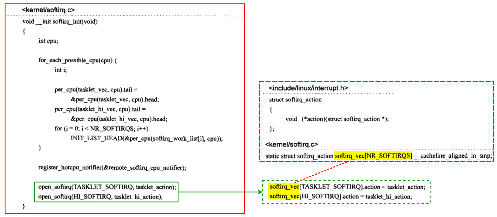

# 延迟操作(未完成)

Linux内核将对一个外部设备中断的处理分成两大部分HARDIRQ和SOFTIRQ，因为HARDIRQ部分在执行时处理器的中断是关闭的，所以驱动程序的中断处理例程在这部分只应该完成一些关键的中断操作，而将耗时的工作延迟到SOFTIRQ部分执行。内核为此给驱动程序提供了一个基于SOFTIRQ的任务延迟的实现机制tasklet。因为tasklet需要在中断上下文中执行，所以有些延迟的操作无法用tasklet来完成，为此内核又提供了一个基于进程的延迟操作实现机制(工作队列workqueue)。当然，驱动程序中可以使用的延迟操作机制并非只有softirq/tasklet和工作队列workqueue这两种，比如定时器timer也可以用来实现延迟的操作。

## 1 tasklet

tasklet是内核定义的几种softirq之一，设备驱动程序的中断处理例程常常利用tasklet来完成一些延后的处理。根据优先级的不同，内核将tasklet分成两种，在softirq中对应TASKLET_SOFTIRQ和HI_SOFTIRQ，后者的执行顺序优于前者。Linux内核定义的softirq有：


### 1.1 tasklet机制初始化

Linux系统初始化期间通过调用softirq_init为TASKLET_SOFTIRQ和HI_SOFTIRQ安装执行函数：



函数中for_each_possible_cpu循环用来初始化tasklet链表变量tasklet_vec和tasklet_hi_vec。

open_softirq用来给TASKLET_SOFTIRQ和HI_SOFTIRQ安装对应的执行函数。

```c
softirq_vec[TASKLET_SOFTIRQ].action = tasklet_action;
softirq_vec[HI_SOFTIRQ].action = tasklethi_action;
```

其中，softirq_vec是一个struct softirq_action类型的数组。数组的每一项都对应一个软中断处理函数指针。


如此，在中断处理的SOFTIRQ部分，如果发现本地CPU的_sofirq_pending上TASKLET_SOFTIRQ或者HI_SOFTIRQ位被置1，就将调用tasklet_action或者tasklet_hi_action。后面会看到softirqpending与softirg_vec数组间的对应关系。

### 1.2 提交一个tasklet


| **成员** | **描述**                                                     |
| -------- | ------------------------------------------------------------ |
| next     | 用来将系统中的tasklet对象构建成链表。                        |
| state    | 记录每个tasklet在系统中的状态，其值是枚举型变量TASKLET_STATE_SCHED和TASKLET_STATE_RUN两者之一。TASKLET_STATE_SCHED表示当前tasklet已经被提交；TASKLET_STATE_RUN只用在对称多处理器系统SMP中，表示当前tasklet正在执行。 |
| count    | 用来实现tasklet的disable和enable操作，count.counter=0表示当前的tasklet是enabled的，可以被调度执行，否则便是个disabled的tasklet，不可以被执行。 |
| func     | 该tasklet上的执行函数或者延迟函数，当该tasklet在SOFTIRQ部分被调度执行时，该函数指针指向的函数被调用，用来完成驱动程序中实际的延迟操作任务。 |
| data     | func所指向的函数被调用时，data将作为参数传给func函数。驱动程序可以利用data向tasklet上的执行函数传递特定的参数。 |


声明了tasklet对象之后，驱动程序需要调用tasklet_schedule来向系统提交这个tasklet。这里所谓的提交，实际上就是将一个tasklet对象加入到tasklet_vec管理的链表中。对于HI_SOFTIRQ，提交tasklet对象的函数为tasklet_hi_schedule，除了用来管理tasklet对象链表的变量为tasklet_hivec外，其他方面完全一样。


鉴于这种代码层面的一致性，所以接下来把讨论的主角设定为tasklet_schedule。为了方便这里的讨论，这里对tasklet_schedule函数进行了轻微的改动。


函数中用到的tasklet_vec是个per-CPU型的变量，用来将系统中所有通过tasklet_schedule函数提交的tasklet对象构建成链表，如果是多处理器系统，那么每个处理器都将用各自的tasklet_vec链表管理提交到其上的tasklet。tasklet_vec声明和类型如下：


tasklet_vec变量的初始化最早发生在Linux系统初始化阶段调用的softirq_init函数中。上一小节提到了该函数，在那里将tasklet_vec的成员head的地址赋给了tail，在tasklet_schedule函数中正是通过操作tail的方式将tasklet对象依次加入到了链表中。

函数首先检查要提交的tasklet的state上的TASKLET_STATE_SCHED位有没有置1，对一个尚未提交过的tasklet对象来说，其值应该是0，所以test_and_set_bit 函数会返回0，同时把tasklet的state上的TASKLET_STATE_SCHED位置1表明这个tasklet已被提交。此后该tasklet对象的TASKLET_STATE_SCHED位一直为1直到被调度运行，因此一个tasklet对象在被成功提交进系统但尚未被调度执行时，处于TASKLET_STATE_SCHED状态。此时即便是在多处理器系统中，运行在其他处理器上的tasklet_schedule函数也无法再次提交一个处于TASKLET_STATE_SCHED状态的tasklet对象，因此**一个tasklet对象在同一时间只可能在一个处理器上运行，而不会同时有多个实例在不同的CPU上运行**。

如果tasklet可以被提交，那么接下来的工作就是把它加入到当前处理器tasklet_vec管理的链表中，然后再通过raise_softirq_irqoff(TASKLET_SOFTIRQ)调用告诉SOFTIRQ部分当前处理器有个TASKLET_SOFTIRQ正等待处理。raise_softirq_irqof用一个整型变量的位来表示该位上是否有待决的softirq等待处理，1表示有，0则是没有。


下面是一个设备驱动程序在其中断处理例程demo_isr中通过tasklet_schedule实现的一个延迟操作示例：

```c
//设备相关的指针
static struct demo_dev*p=..;

//延迟操作函数
void demo_delay_action(unsigned long data)
{
    //通过data获得设备相关指针
    static struct demo_dev*pdev=(static struct demo_dev *)data;
    
    //延迟操作
 	....   
}

//用DECLARE_TASKLET(name,func,data)定义一个tasklet对象demo_tasklet
DECLARE_TASKLET(demo_tasklet, demo_delay_action,(unsigned long)p);

//中断处理例程
irqreturn_t demo_isr(int irq, void * dev_id)
{
    ....
    //通过tasklet_schedule实现延迟操作
    tasklet_schedule(&demo_tasklet);
}
```

### 1.3 tasklet_action

本节将介绍中断处理的SOFTIRQ部分如何去调用这些延迟的操作函数。

在“tasklet机制初始化”小节，内核为TASKLET_SOFTIRQ和HI_SOFTIRQ分别安装了执行函数tasklet_action和tasklet_hi_action，鉴于这两个执行函数的实现机制完全一样，在此只对tasklet_action的实现机制进行分析。下面是这个函数的实现：


函数的主体是个while循环，在进入while循环之前，需要得到tasklet链表的头指针，这需要访问per-CPU变量tasklet_vec，因为该变量用来管理tasklet链表，tasklet_vec.head指向tasklet链表的第一个节点。在访问tasklet_vec之前，函数用local_irq_disable关闭了处理器的中断，这是因为虽然tasklet_vec在系统的每个处理器中都有个副本，但是在单一CPU的范围里，依然存在SOFTIRQ在执行时被外部设备中断，在它的中断处理例程中使用到了tasklet的功能比如调用tasklet_schedule来提交一个tasklet对象，这样会导致两个执行路径都有操作tasklet_vec的可能性。所以此处用local_irq_disable和local_irq_enable来保护tasklet_vec不会在可能的并发访问中遭到破坏，其间的代码将tasklet_vec管理的链表的第一个节点存放在本地变量list中，然后将tasklet_vec设置成其最初的状态（空链表）。

> [!NOTE]
>
> 在继续对while循环中代码的讨论之前，有两点需要注意：
>
> 首先，tasklet_action作为一个softirq 执行函数，在多处理器系统中可能同时在不同的CPU上运行。虽然一个处于TASKLET_STATE_SCHED状态的tasklet对象不能被多次提交，但是当一个tasklet对象被调度运行时，TASKLET_STATE_SCHED状态位会被清除，这样就可能导致该tasklet对象在别的处理器上被重新提交。考虑一下如下的情形：在一个有A和B两个处理器的系统中，某设备对处理器A产生了一次中断，在它的中断处理例程中会调用tasklet_schedule函数向系统提交-一个tasklet对象，假设处理器A已经进入本次中断处理的SOFTIRQ部分并且正在运行该tasklet，注意此时它的TASKLET_STATE_SCHED状态位已经被清除，此时该设备又产生了一次中断，这次的中断发送给了处理器B，处理器B在它的中断处理例程中同样会调用tasklet_schedule把同一个tasklet对象向处理器B上的tasklet_vec链表提交，因为该tasklet的TASKLET_STATE_SCHED状态位已经被清除，所以提交是可能成功的。如此就可能出现同一tasklet对象的执行函数在不同的处理器上同时运行的情形，因此while循环需要某种机制来确保这种情况不会发生。我们不妨把这个问题称为SMP中tasklet运行冲突的问题，等下会在while循环具体的代码实现中看到内核对此给出的解决方案。
>
> 其次，在while循环中tasklet_action通过一个本地变量list来实现对tasklet链表的遍历。对于遍历过程中的每一个tasklet节点，如果不满足执行的条件，将通过操作tasklet_vec.tail指针将其重新加入taskletvec链表；如果它被成功执行了，那么该tasklet对象将不会再出现于tasklet_vec链表中。通过启用一个本地变量list，使得我们在调用tasklet上的执行函数时，无须再考虑list链表的互斥访问问题，因此读者可以看到tasklet上的执行函数在运行期间，中断是打开的，这也是SOFTIRQ当初的设计初衷。如果考虑到在某个tasklet运行期间发生了中断，那么可能会有新的tasklet要被提交到当前处理器的tasklet_vec链表上，不过这不会影响到list所在链表，新的tasklet对象将会加入到tasklet_vec链表中。如此，在tasklet_action执行前后，tasklet_vec链表发生的变化是：一些新的tasklet对象可能被提交进来，只是因为还没有被运行过，所以新节点将处于TASKLET_STATE_SCHED状态，而被运行过的老节点其TASKLET_STATE_SCHED状态位将被清除，而且也不会再出现在当前处理器的tasklet_vec链表中。

现在来看看while循环实际的代码，tasklet_trylock在单处理器系统中直接返回1，在多处理器中，其定义是：


函数将tasklet中state的TASKLET_STATE_RUN位置1，同时返回TASKLET_STATE_RUN位原来的值。因此，while循环中的if（tasklet_trylock(t))实际上就是用来解决前面提到的SMP中tasklet运行冲突的问题的。在SMP系统中一个运行中的tasklet（其TASKLET_STATE_RUN位被置I，TASKLET_STATE_SCHED位被清0）有可能被重新提交到另一个处理器的tasklet_vec链表中，为了防止该tasklet同时在不同的处理器上运行，内核在SMP系统中为tasklet对象增加了一个额外的状态位TASKLET_STATE_RUN，这个状态位只对SMP系统有效，单处理器系统不需要这个状态。内核用tasklet对象的TASKLET_STATE_RUN位来标记对应的tasklet当前是否正在运行，如果没有，那么tasklet_trylock(t)将返回真，同时tasklet_trylock也会将state中的TASKLET_STATE_RUN位置1，这样别的CPU再运行tasklet_action时，将不会处理该tasklet直到其运行完毕清除掉TASKLET_STATE_RUN。内核通过这种方式实现了tasklet的串行化：任一时刻tasklet只可能在一个CPU上运行。对于单处理器，不存在tasklet运行冲突的问题，所以tasklet_trylock直接返回1。

接下来通过atomic_read对tasklet的count成员进行测试，这个成员主要用来实现enable或者disable一个tasklet，如果某个tasklet对象的count为0，说明它处在enabled的状态。对于一个enabled的tasklet，需要再测试其state的TASKLET_STATE_SCHED位有没有被置1，提交tasklet的函数会设置该位，如果该位没有被设置，说明tasklet_action函数正试图调度一个没有被提交的tasklet，这是非正常状况。如果一切顺利，当前tasklet上的函数被调用，意味着延迟的操作开始进行。从代码中可以看到，如果一个tasklet被调度执行完之后，其state的TASKLET_STATE_SCHED位被清0，这意味着除非被再次提交，否则下次的SOFTIRQ部分将不会再调度到它，这是一种one-shot特性：提交一次，调度运行一次，运行完后就从CPU的tasklet_vec链表中消失，除非有代码再次提交该tasklet对象。

通过上面对tasklet_action的分析可以看出，一个提交的tasklet在被SOFTIRQ调度执行完后，将从当前处理器的tasklet_vec链表中消失，因此除非再次提交，否则该tasklet对象将不会有机会被再次运行。同时，内核对tasklet的实现机制确保了同一个tasklet对象不会同时在不同的处理器上运行，因此驱动程序在实现tasklet的延迟函数时，无须考虑多处理器间的并发问题。另外，tasklet运行在中断上下文环境中，因此在中断上下文中的种种限制同样适用于tasklet的延迟函数。这些都是tasklet这种机制最典型的特质。

### 1.4 tasklet的其他操作

#### 1 tasklet_disable和tasklet_disable_nosync


disable本身的行为很简单，将要操作的 tasklet对象t上的count加1就可以了。相对于tasklet_disable_nosync，tasklet_disable 是个“同步”版本，它在调用 tasklet_disable_nosync函数之后，会再调用tasklet_unlock_wait 函数实现所谓“同步”功能，这里的术语“同步”只限于SMP系统，单处理器系统中，tasklet_unlock_wait什么也不做。多处理器系统中，如果要disable的tasklet正在运行，那么tasklet_unlock_wait要一直忙等待到t的TASKLET_STATE_RUN状态位被清除，就是说tasklet_disable要等到t运行完毕才会返回，这意味着tasklet_disable返回之后，可以确保该tasklet不会在系统的任何地方运行。

一个处于disabled状态的tasklet可以被提交到tasklet_vec中，但是不会被调度执行。

#### 2 tasklet_enable


将指定的tasklet对象t上的count减1。一个tasklet对象要能被执行，count应该为0。所以如果想enable一个先前被disable的tasklet，使之能被调度执行，**tasklet_enable和taskletdisable的调用次数要匹配**。

#### 3 tasklet_kill


该函数通过清除一个tasklet对象的TASKLET_STATE_SCHED状态位，使SOFTIRQ不再能够调度运行它。如果当前tasklet对象正在运行，那么tasklet_kill将忙等待直到tasklet运行结束，这样可以确保tasklet_kill返回后系统中不再有运行中的该tasklet对象。如果一个tasklet对象被提交到了系统但还没有被调度执行，那么针对该tasklet对象调用tasklet_kill，后者将会睡眠直到该tasklet被执行完从tasklet_vec链表中移除，所以tasklet_kill是个可能会被阻塞的函数。

一般在设备驱动程序所在的内核模块要被移除或者是设备要被关闭时，才调用该函数，因为这种情况下虽然你可以删除tasklet对象所在的空间，但这不会影响到tasklet_vec已有的链表元素构成，所以一个可能的情况是，在你的驱动模块已经移出系统，SOFTIRQ还是调度运行了你的驱动程序提交的tasklet对象，这是一种危险情况，因为当你的模块已经从系统中移除之后，被调度运行的tasklet函数也许会使用到模块中的资源，但是现在它们已经不存在了。内核模块调用tasklet_kill可以确保不会发生这种情况。

## 2 工作队列

工作队列是设备驱动程序可以使用的另一种延迟执行的方法。为了实现这种延迟执行的机制，内核或者驱动程序需要建立一套完整的基础设施，这里的设计思想与现实中的工厂加工非常相像：基础设施就是一条加工厂的成产流水线和在流水线上工作的工人，平时没事的时候，流水线上的工人就休息。如果某一客户想要加工一件工件，只需要把要加工的工件打个包（包里放有记载该工件应该如何加工的文档），扔到流水线上，然后客户可以继续做自己的事情。流水线上的工人发现有活要做，就结束休息，帮助客户加工工件。这个我们所熟悉的场景对应到Linux内核代码的世界，流水线变成了worklist，工人变成了worker_thread，打成包的工件就是structwork_struct对象，把包扔到流水线的工作变成了queue_work函数的调用等等，所有这些我们都将在接下来的内容中看清它们的内部运作流程。为了叙述上的方便，我们不妨就把这整个所谓的基础设施统称为工作队列。

内核本身提供了一套默认的工作队列，但是驱动程序自身也可以另起炉灶创建属于自己的基工作队列。本节将先从驱动程序创建自已的工作队列谈起，讨论整个延迟处理的工作流程，然后再把讨论的范围延伸到内核自已创建的基础设施上去，最后对比工作队列与tasklet机制的区别以及各自的适用场景。

### 2.1 数据结构

驱动程序要通过工作队列实现延迟操作，需要生成一个struct work_struct对象(工作节点)，然后通过queue_work函数将其提交给工作队列。


| **成员** | **描述**                                                     |
| -------- | ------------------------------------------------------------ |
| data     | 驱动程序可以利用data来将设备驱动程序使用的某些指针传递给延迟函数。 |
| entry    | 双向链表对象，用来将提交的等待处理的工作节点形成链表。       |
| func     | 工作节点的延迟函数，用来完成实际的延迟操作。原型：`typedef void (*work_func_t)(struct_work *work)`; |

实际的代码中，structcpu_workqueue_struct对象是个per-CPU型的变量，通过alloc_percpu函数动态创建，系统中的每个CPU都有一份，struct cpu_workqueue_struct(CPU工作队列管理结构)。


| **成员**     | **描述**                                                     |
| ------------ | ------------------------------------------------------------ |
| lock         | 对象的自旋锁，用于对可能的并发访问该对象时提供互斥保护机制。 |
| worklist     | 双向链表对象，用来将驱动程序提交的工作节点形成链表。驱动程序中的延迟操作以工作节点的形式存在。 |
| more_work    | 等待队列头节点，工作队列的工人线程（worker_thread）没有工作节点需要处理时将进入睡眠状态，此时它需要进入该等待队列。 |
| current_work | 用于记录当前工人线程正在处理的工作节点。                     |
| wq           | 指向系统工作队列管理结构，接下来有它的具体定义。             |
| thread       | 指向工人线程所在的进程空间结构。                             |

相对于上面的CPU工作队列管理结构，本书称 struct workqueue_struct 为工作队列管理结构，内核会为创建的每个工作队列生成一个工作队列管理结构对象。


| **成员**     | **描述**                                                     |
| ------------ | ------------------------------------------------------------ |
| cpu_wq       | 指向CPU工作队列管理结构的per-CPU类型的指针。根据该指针，系统中的每个CPU都可以通过per_cpu_ptr来获得属于自已的CPU工作队列管理结构的对象。 |
| list         | 双向链表对象，用于将工作队列管理结构加入到一个全局变量workqueues中，只对非singlethread工作队列有效。 |
| name         | 工作队列的名称。                                             |
| singlethread | 标识创建的工作队列中工人线程的数量。                         |
| freezeable   | 表示进程可否处于冻结状态。                                   |
| rt           | 用来调整worker_thread线程所在进程的调度策略。                |


### 2.2 create_singlethread_workqueue和create_workqueue

设备驱动程序通过这两个函数创建属于自已的基础设施，严格地说，其实它们是宏，不过这种文字上的小区别对理解整个流程的内核实现并没有什么特别的意义，所以不妨先展开来看看它们各自的定义：


最终调用的都是\_\_create_workqueue_key函数。区别在于第二个参数singlethread的不同。


第一阶段：使用kzalloc生成了一个工作队列管理结构的对象wq并且初始化。同时利用alloc_precpu函数生成了per-CPU类型的CPU工作队列管理结构对象。

第二阶段：函数根据参数singlethread的值对单线程队列和多线程队列分别进行处理。

create_singlethread_workqueue 函数生成的工作队列是单线程的，singlethread=1，对这种情况，函数需要做的是：

(1) 用init_cpu_workqueue函数，在该函数中获得系统中第一个CPU（代码中的称谓是singlethread_cpu）对应的CPU工作队列管理结构的指针cwq，同时初始化cwq 中的等待队列和双向链表等成员变量。

(2) 用create_workqueue_thread 函数生成工人线程（worker_thread）。Linux内核中所谓的内核线程其实是一个进程，拥有独立的task_struct结构，这里的工人线程也不例外。create_workqueue_thread函数实际的操作是生成一个新的进程，将该进程task_struct中保存有进程执行现场寄存器的pc值指向worker_thread函数（worker_thread函数为工人线程的线程函数），这样当该进程被调度运行时将执行worker_thread函数，传给函数的参数是系统中第-个CPU上的cwq指针。新进程的task_struct结构体指针p将保存在CPU工作队列管理结构的 thread 成员中：cwq->thread=p。

(3) 用start_workqueue_thread函数，后者再通过wake_up_process 函数将新进程投入到系统的运行队列中：wake_up_process(p)，如此之后新进程就具备了被调度器调度运行的条件。

如果singlethread不为1，那么_create_workqueue_key将对系统中的每个CPU调用singlethread中的三大步骤，这样每个CPU都将拥有自己的CPU工作队列管理结构和工作在其上的工人线程。这种情况下，工作队列管理结构对象wq还将把自已加入到workqueues管理的链表中，workqueues是一个全局型的双向链表对象，用来链接系统中所有非singlethread的工作队列：


singlethread工作队列框图如下：


图中，内核部分描述了通过create_singlethread_workqueue创建的工作队列及其上的工人线程worker_thread，后者的任务是操作worklist链表上的工作节点，如果worklist上面没有工作节点，那么worker_thread所在的进程将进入睡眠状态并驻留在more_work维护的等待队列中。驱动程序部分将要延迟的操作打包进structwork_struct类型的工作节点中，然后通过queue_work向worklist上提交该工作节点，最后唤醒worker_thread线程。对于非singlethread工作队列，上面的工作原理依然适用，只是此时系统中的每个CPU都拥有自己的工作队列和工人线程worker_thread。至于驱动程序提交节点时向哪个工作队列提交，在提交工作节点queue_work部分再讨论。

### 2.3 工人线程worker_thread

工人线程worker_thread用来处理驱动程序提交到工作队列中的工作节点，如果工作队列中没有节点需要处理，那么它将睡眠在cwq->more_work表示的等待队列中。worker_thread运行在一个独立的新进程空间中。


worker_thread的主体是for(;)循环，它首先用kthread_should_stop检测有没有别的函数对它调用了kthread_stop，如果有的话，代表该线程的kthread对象的should_stop成员将被置1，此时worker_thread将通过break跳出循环，线程函数所在的进程将会终结。如果worker_thread不需要stop而且cwq->worklist上也没有工作节点等待处理，工人线程将调用schedule以TASK_INTERRUPTIBLE状态睡眠在等待队列cwq->more_work中，直到驱动程序向cwq->worklist上提交了一个新的节点并唤醒worker_thread，它醒来之后将调用run_workqueue来处理cwq->worklist上的工作节点。

函数在while循环中遍历cwq->worklist链表，对于其中的每个工作节点work，先将其从cwq->worklist链表删除，然后调用工作节点上的延迟函数f(work)，传递给函数的参数是延迟函数所在工作节点的指针work。从run_workqueue的代码可以看出，一个工作节点被处理完之后，将不会再出现在工作队列的cwg->worklist链表中，除非被再次提交。

函数中的work_clear_pending用来清除work->data的WORK_STRUCT_PENDING位（位0），这里内核把work->data的低2位用于记录work的状态信息，当驱动程序调用queue_work向工作队列提交节点work时，queue_work会把work->data的WORK_STRUCT_PENDING位置1，这是为了防止驱动程序将一个尚未被处理的工作节点再次向cwq->worklist上提交。

### 2.4 destroy_workqueue

destroy_workqueue 执行与 create_singlethread_workqueue/create_workqueue 相反的任务，当驱动程序不再需要使用后者创建的工作队列时（比如驱动程序所在的模块要从系统中移走或者关闭设备等），需要调用destroy_workqueue来做工作队列的清理善后工作，比如释放create_workqueue分配使用的一些系统资源如内存等，还有worker_thread线程也应该被安全地终结。


destroy_workqueue函数除了将wq从workqueues中移除，及释放工作队列管理结构等对象所占内存外，主要的工作是调用cleanup_workqueue_thread来完全地终结worker_thread，因为destroy_workqueue被调用的时候，worker_thread很有可能正在处理worklist中余下的工作节点，因此函数要小心处理，避免发生不必要的麻烦。

cleanup_workqueue_thread函数主要作用是通过调用kthread_stop函数来让worker_thread所在的进程终止，因为一旦进程的执行函数worker_thread结束，进程就将调用do_exit 而终结，所以kthread_stop让worker_thread结束的原理就是设置should_stop=1，前面在讨论worker_thread时已看到过should_stop的这一用法。

