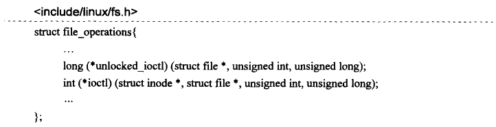
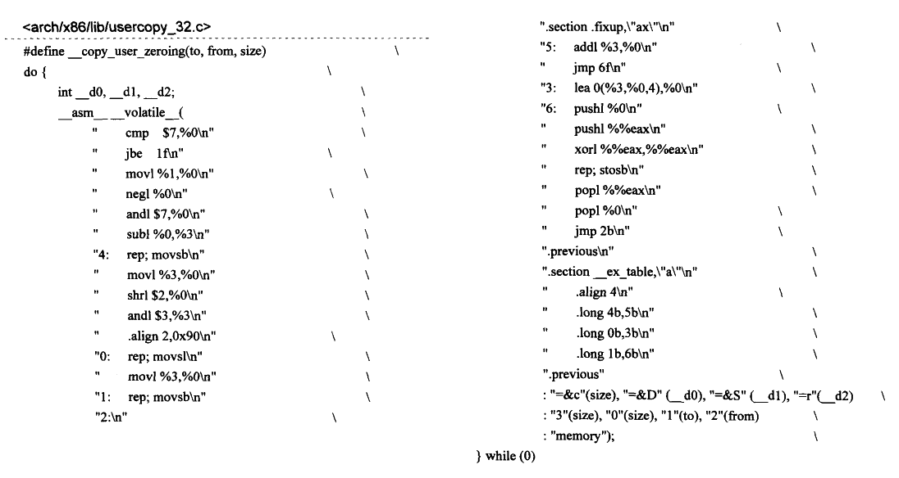
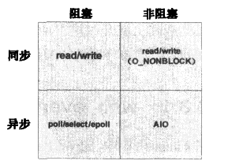

# 设备文件的高级操作

## 1 ioctl文件操作

设备文件的ioctl操作常用来对设备的行为进行某种控制，典型的用法比如一个串口设备，可以通过ioctl配置其波特率和流控方法等。所以ioctl一般用来在用户空间的应用程序向驱动模块之间传递控制参数，而很少用于大数据量的传递。

### 1.1 ioctl的系统调用

用户空间程序如何调用到设备驱动程序中实现的ioctl。在用户空间，ioctl的原型为：

对于驱动程序而言，需要实现的ioctl函数的原型有两个：

驱动程序中应该实现的是unlocked_ioctl，ioctl在Linux内核中属于比较陈旧的代码，之所以还存在，是考虑到一些老的驱动只实现了ioctl，调整这些代码的工程量巨大。在后续对ioctl系统调用的讨论中，会看到这两者之间的区别。本文为了叙述的方便，将驱动程序中实现的这些函数原型统称为ioctl函数。

当用户空间程序调用ioctl函数时，系统会经过sys_ioctl进入到内核空间。系统调用sys_ioctl的定义为：

> [!NOTE]
>
> 当用户空间打开一个设备文件时，内核将为之分配一个文件描述符fd，同时生成一个structfile对象filp，fd与filp通过当前进程的files管理的文件描述符表关联起来，这意味着当接下来在刚打开的文件上执行其他操作时，比如这里的ioctl，系统会把打开文件时获得的文件描述符fd作为参数传递给ioctl函数。在ioctl的系统调用函数sys_ioctl中，第一个参数就是刚打开文件的描述符fd，因此可以推测sys_ioctl将会用fd作为进程管理的文件描述符表的索引，继而得到fd所对应的structfile对象的指针filp，这个filp对象在之前打开文件的操作中已被创建并初始化，其中最重要的初始化是把设备对象cdev中的ops指针赋给了filp->f_op，因此通过filp->f_op将调用到驱动程序提供的文件操作函数。

sys_ioctl函数首先调用fget_light通过fd获得struct file对象的指针filp，然后调用最关键的do_vfs_ioctl函数。

do_vfs_ioctl函数会判断用户空间传过来的CMD是否为默认支持的CMD，如果不是则会进入default分支(事实上大部分都是调用default)，调用vfs_ioctl函数。

vfs_ioctl函数则会调用底层的cdev中实现的struct file_operations中的ioctl函数。所以在你的设备驱动程序模块中要么实现了file_operations中的unlocked_ioctl，要么是实现了ioctl，它们都将在vfs_ioctl函数中的if...else if...框架中被检验并被调用，来自用户空间的cmd和arg参数将原样不动地传递给它们，驱动程序模块中实现的ioctl显然需要通过某些手段来获得用户空间的参数，在接下来的讨论中将看到这一点。

关于这里的unlocked_ioctl和ioctl调用，前面已经提过ioctl属于老的代码，在vfs_ioctl函数的实现中可以看到，内核在调用ioctl时，使用了lock_kernel和unlock_kernel作为互斥的手段。lock_kernel和unlock_kernel是一种粗粒度的所谓大内核锁BKL（BigKernelLock），这种全局范围内使用的锁相对于现代的细粒度的锁机制而言，很明显会降低系统的性能，所以虽然大内核锁依然存在于2.6版本的内核中，但应该避免使用。现代的设备驱动程序应该使用unlocked_ioctl，它们已经脱离了大内核锁的保护，因此驱动程序在实现unlocked_ioctl函数时，应该使用自己的互斥锁机制。关于unlocked_ioctl和ioctl的更多讨论可以参考http://lwn.net/Articles/119652/。

### 1.2 ioctl的命令编码

ioctl主要用来在用户空间程序和设备驱动模块之间传递控制信息，这个控制信息以cmd和arg的形式存在，因此需要在用户空间和内核空间建立一套规则来构造和解析cmd参数的组成，这样做的目的是确保任何一个遵循这些规则编码出来的cmd在系统范围内具有唯一性：如果有人无意间使用了某一cmd编码来对设备进行ioctl操作，驱动程序应该能识别出这一无意识的错误并返回相应的信息。

#### 构造cmd

内核为此定义了一套完整的宏，设备驱动程序应该使用这些宏来定义和解析各自使用的cmd参数。为构造ioctl的cmd参数，内核使用了一个32位无符号整数并将其分成四个部分，如下图所示：

- NR：为功能号，长度为8位（_IOC_NRBITS)。
- TYPE：为一ASCII字符，假定对每个驱动程序而言都是唯一的，长度是8位（_IOC_TYPEBITS)。实际的宏定义中因常常含有“MAGIC”字样，所以有时候也被称为魔数。
- SIZE：表示ioctl调用中arg参数的大小，该字段的长度与体系架构相关，通常是14位（_IOC_SIZEBITS）。接下来会看到，其实内核在ioctl的调用中并没有用到该字段。
- 表示cmd的类型：read、write和read-write，长度是2位。这个字段用于表示在ioctl调用过程中用户空间和内核空间数据传输的方向，此处方向的定义是从用户空间的视角出发。内核为该字段定义的宏有：\_IOC_NONE，表示在ioctl 调用过程中，用户空间和内核空间没有需要传递的参数；\_IOC_WRITE，表示在ioctl调用过程中，用户空间需要向内核空间写入数据：\_IOC_READ，表示在ioctl调用过程中，用户空间需要从内核空间读取数据；\_IOC_WRITE丨\_IOC_READ，表示在ioctl调用过程中，参数数据在用户空间和内核空间进行双向传递。

为了方便内核使用如下宏来构造cmd参数：

其中\_IOC_TYPECHECK用来对宏参数size进行检测，在\_\_KERNEL\_\_的情况下有效，否则退化为sizeof运算符。

#### 解析cmd

以上介绍的是内核为构造ioctl 命令cmd 所定义的宏。与此类似，内核为解析出这些cmd中的各个字段也定义了对应的宏：

这些宏的定义都比较直观易懂，这里不再多作介绍。

至此就介绍完了ioctl的命令构造和解析的方法。在实际使用这些宏的时候，有一点需要注意，前面在讨论ioctl系统调用的流程时，曾提到sys_ioctl最终会调用do_vfs_ioctl，在那里函数会用switch...case语句对系统中几个预定义的cmd进行先行处理，所以设备驱动程序在定义自己的ioctl cmd时不应该和这些预定义的cmd发生冲突，否则内核将不会调用到驱动程序实现的ioctl函数，而且应用程序因为误用了系统预定义的ioctl命令而导致其行为的不可预期。一些常见的预定义有：

| **CMD**  | **描述**                                                     |
| -------- | ------------------------------------------------------------ |
| FIOCLEX  | 执行时关闭标志，即FileIOctl CLose on EXec，通知内核在调用进程执行一个新程序时，比如exec(系统调用，自动关闭打开的文件。 |
| FIONCLEX | 清除执行时关闭标志，即FileIOctl NotCLose onEXec，与FIOCLEX标志相反，清除由FIOCLEX命令设置的标志。 |
| FIONBIO  | 文件的 ioctl 为非阻塞型I/O 操作，即 File IOctl Non-Blocking I/O，这个调用修改在filp->f_flags 中的O_NONBLOCK标志。 |
| FIOASYNC | 设置或者复位文件的异步通知，这两个动作在内核中实际的执行者是fcntl，所以内核代码并不使用该cmd。 |
| FIOQSIZE | 获得一个文件或者目录的大小，用于设备文件时，将返回一个ENOTTY错误。 |

### 1.3 copy_from_user和copy_to_user

copy_from_user和copy_to_user 两个函数用于在用户空间和内核空间传递数据，设备驱动程序的ioctl函数实现中经常会用到这两个函数。先来看copy_from_user函数：

先看函数的三个参数，\*to是内核空间的指针，\*from是用户空间指针，n表示从用户空间向内核空间拷贝数据的字节数。关于函数的返回值，如果成功完成拷贝动作，返回0，否则返回还没有完成拷贝的字节数。

might_sleep在定义了CONFIG_PREEMPT_VOLUNTARY的情况下会形成一个显式的抢占调度点，换句话说might_sleep可能会自动放弃CPU，关于这方面的细节不是本书要讨论的主题，总之，copy_from_user有可能让当前进程进入睡眠状态。

access_ok 用来对用户空间的地址指针from 作某种有效性检验，这个宏的定义是体系架构相关的，在ARM平台上为：

可以看到，access_ok中第一个参数type并没有被用到，\_\_range_ok的作用在于判断addr+size之后是否还在进程的用户空间范围之内。

接下来是核心函数\_\_copy_from_user，该函数的定义也是体系架构相关的，这里不打算一步一步详细展开这个函数。为了让读者理解在驱动程序中使用copy_from_user的必要性，下面给出x86平台上该函数的核心实现：

这段汇编代码在".section .fixup,\\"ax\\"\n"之前就是常规的内存拷贝操作(基本等同于x86平台上的memcpy的实现)，特殊的地方在于后半段定义的两个section：".fixup"和"\_\_ex_table"。

> [!NOTE]
>
> 为什么要使用copy_from_user函数呢？
>
> 理论上说，内核空间可以直接使用用户空间传过来的指针，即使要做数据拷贝的动作，也可以直接使用memcpy，事实上在没有MMU 的体系架构上，copy_from_user最终的实现就是利用了memcpy。但是对于大多数有MMU的平台，情况就有了些变化：用户空间传过来的指针是在虚拟地址空间上的，它所指向的虚拟地址空间很可能还没有真正映射到实际的物理页面上。但是这又能怎样呢？缺页导致的异常会很透明地被内核予以修复（为缺页的地址空间提交新的物理页面)，访问到缺页的指令会继续运行仿佛什么都没有发生一样。但这只是用户空间缺页异常的行为，在内核空间这种缺页异常必须被显式地修复，这是由内核提供的缺页异常处理函数的设计模式决定的，其背后的思想是：在内核态，如果程序试图访问一个尚未被提交物理页面的用户空间地址，内核必须对此保持警惕而不能像用户空间那样毫无察觉。

标号4处显然是个内存访问指令，如果搬移（mov）的源地址（在用户空间）位于一个尚未被提交物理页面的空间中，将产生缺页异常，内核会调用 do_page_fault 函数来处理这个异常，因为异常发生在内核空间，do_page_fault 将调用 search_exception_tables在"\_\_ex_table"section中查找产生异常指令所对应的修复（fixup）指令。在\_\_copy_user_zeroing 函数的后半段，在"\_\_ex_table"section 中定义了如下数据：

其中4b对应标号4处的指令，5b对应标号5处的指令，是4b处指令的修复指令。这样，当标号4处发生缺页异常时，系统将调用do_page_fault提交物理页面，然后跳转到标号5的指令处继续运行。

如果在驱动程序中不使用copy_from_user而用memcpy来代替，对于上述的情形会产生什么结果呢？当标号4处发生缺页异常时，系统在"\_\_ex_table"section中将找不到修复地址（因为 memcpy 没有像 copy_from_user 那样定义一个"\_\_ex_table"section），此时 do_page_fault将通过no_context函数产生oops，极有可能会看到类似如下信息：

所以为了确保设备驱动程序的安全，应该使用copy_from_user函数而不是memcpy。

这里用了x86平台作为例子，虽然其他平台上的实现可能会有不同，但是总体上它们的设计思想是一样的。

如果需要将内核空间的数据拷贝到用户空间，可以使用copy_to_user函数，其背后的设计理念和copy_from_user完全一样。该函数的定义为：

参数*to是用户空间指针，*from是内核空间指针，n是要拷贝的字节数。如果拷贝成功函数返回0，否则返回尚未被拷贝的字节数。

除了上述的copy_from_user和copy_to_user函数，在用户空间和内核空间交换数据时还有两个常用的函数：get_user和put_user。相对于copy_from_user和copy_to_user，这两个函数主要用来完成一些简单类型变量（char、int、long等）的拷贝任务，对于一些复合类型的变量，如数据结构或者数组类型，get_user 和put_user 函数则无法胜任：函数内部将对ptr所指向的对象长度进行检查，大部分平台只支持长度为1,2,4的变量。

- get_user 将用户空间 ptr指向的数据拷贝到内核空间的变量x中，其内部实现虽然多为单条汇编指令实现的内存操作（比如x86的MOV指令、ARM的LDR指令等），但依然会有".fixup"和"\_\_ex_table"section。函数如果成功则返回O，否则返回-EFAULT。

- put_user 用来将内核空间的一个简单类型变量x拷贝到 ptr 所指向的用户空间中。函数能自动判断变量的类型，如果成功则返回0，否则返回-EFAULT。

以下是get_user和put_user的用法示例：

在设备驱动程序中，其实现的ioctl函数主体往往都是一个switch....case结构，下面是一个实际的设备驱动程序实现的unlocked_ioctl代码片段：

以上是一个比较典型的ioctl的实现，代码首先用\_IOC_TYPE对cmd进行初步的检验，之后调用access_ok来验证用户空间指针的有效性，因为access_ok在ioctl函数开始就被调用了，所以之后都是用的\_\_put_user、\_\_get_user 和\_\_copy_from_user 这样的形式，否则应该使用put_user、get_user和copy_from_user。因为是unlocked_ioctl函数，所以驱动程序需要实现自己的互斥机制，上面的例子中使用的是mutex_lock和mutex_unlock。ioctl函数的返回值应该用来表示该函数的执行状态，有些书认为可以把它作为在用户空间和内核空间进行数据交换的一种方式，这不是一种好的编码习惯。

## 2 字符设备的I/O模型

一个字符设备的主要功能是用来实现I/O操作，反映到应用程序中就是进行read和write等相关的操作。在对一个设备进行读写操作时，鉴于设备在实际的操作中响应速度各不相同，因此数据并不总是在任何时候都可用：对于读操作来说，也许请求的数据还没有达到设备的缓冲区；对于写操作来说，应用层传递过来的数据也许不能够一下子全部放进设备狭小的缓冲区。此时对于这些读写操作来说，要么放弃等待直接返回一个错误码给上层，要么让发起读写操作的进程进入等待状态直到数据可用为止。

根据不同的需求和使用场景，Linux内核支持几种不同的I/O操作模式，称为字符设备的I/O模型，这些模型根据同步与异步、阻塞与非阻塞可以划分为四大类。下图简单地描述了这种I/O模型的分类：

- 同步阻塞I/O：这是1/O模型中最常用的一种操作。对于这种同步阻塞型I/O，应用程序执行一个系统调用对设备进行read/write操作，这种操作会阻塞应用程序直到设备完成read/write操作或者返回一个错误码。在应用程序阻塞的这段时间里，程序所代表的进程并不消耗CPU的时间，因此从这个角度而言，这种操作模式是非常高效的。为了支持设备的这种I/O操作模式，设备驱动程序需要实现file_operations对象中的read和write方法。
- 同步非阻塞I/O：在这种I/O操作模式下，设备文件以非阻塞的形式打开（O_NONBLOCK），如果设备不能立即完成用户程序所要求的I/O操作，应该返回一个错误码（EAGAIN或者EWOULDBLOCK，两者是同一个值)。
- 异步阻塞I/O：这种模式的I/O操作并不是阻塞在设备的读写操作本身，而是阻塞在某一组设备文件的描述符上，当其中的某些描述符上代表的设备对读写操作已经就绪时，阻塞状态将被解除，用户程序随后可以对这些描述符代表的设备进行读写操作。Linux的字符设备驱动程序需要实现file_operations对象中的poll方法以支持这种I/O模式。
- 异步非阻塞I/O：在这种I/O操作模式下，读写操作会立即返回，用户程序的读写请求将被放入一个请求队列中由设备在后台异步完成，当设备完成了本次的读写操作时，将通过信号或者回调函数的方式通知用户程序。需要说明的是，Linux系统的设备中，块设备和网络设备的I/O模型属于异步非阻塞型，对于字符设备而言，极少有驱动程序需要去实现这种模式的1/O操作。

字符设备驱动程序应该根据具体的需求实现上面四种1/O模型中的部分或全部，本节将讨论驱动程序如何实现这些I/O模型。下面先讨论同步模式下的阻塞和非阻塞操作，然后再讨论异步模式的阻塞与非阻塞操作。

## 3 同步阻塞型I/O

本节讨论驱动程序对同步阻塞型I/O方法read和write实现机制的底层支持，介绍在实现阻塞型I/O时内核为设备驱动程序提供的相关设施。这些内核实施的核心设计建立在**等待队列**的基础之上，下面将在此基础上展开讨论驱动程序实现阻塞型I/O时用到的核心函数wait_event系列和wake_up系列，在这部分讨论中首先介绍使用频率最广的函数，然后再延伸到其他的一些变体函数。

### 3.1 wait_event_interruptible

在Linux内核中，宏wait_event_interruptible用来将当前调用它的进程睡眠等待在一个event上直到进程被唤醒并且需要的condition条件为真。睡眠的进程状态是TASK_INTERRUPTIBLE的，这就意味着它可以被用户程序所中断而结束。但通常是进程等待的这个event发生了，它被唤醒重新加入到调度器的运行队列中等待下一次调度执行，这个宏的定义为：

wait_event_interrupt在condition条件不为真时将睡眠在一个等待队列wq上，所以函数首先判断condition是否为真，如果为真，函数将直接返回，否则调用它的进程将通过\_\_wait_event_interruptible最终进入睡眠状态，后者是操作进程睡眠与否的核心函数：

\_\_wait 中的autoremove_wake_function 函数在节点上的进程被唤醒时被调用，private指向当前调用wait_event_interrupt的进程。

接下来是函数的核心结构for(;)循环，首先是调用prepare_to_wait 来完成睡眠前的准备工作，该函数要做的具体任务是：

- 清除\_\_wait节点flags中的WQ_FLAG_EXCLUSIVE标志，该标志在唤醒函数中要用到：\_\_wait->flags &=~WQ_FLAG_EXCLUSIVE。
- 将\_\_wait节点加入到等待队列wq中：\_\_add_wait_queue(q,wait)，该函数将把_wait 节点加入到等待队列中成为头节点后的第一个等待节点，所以后进来的进程将最先被唤醒。
- 将当前进程的状态设置为TASK_INTERRUPTIBLE。

prepare_to_wait 之后进程依然在调度器的运行队列中，之后如果condition 条件依然为假并且当前进程也没有等待的信号需要处理，schedule函数将被调用，在那里调度器将把当前进程从它的运行队列中移除，**wait_event_interruptible的表现形式是阻塞（block）在了schedule函数上直到进程下次被唤醒并被调度执行**。

当进程被唤醒时，schedule函数返回（此时进程状态为TASK_RUNNING，所在的等待节点\_\_wait已经从wq中删除），通过continue继续for循环直到condition为真时，才通过break进入到finish_wait，后者基本是prepare_to_wait 的一个反向操作：重新设置进程状态为TASK_RUNNING，然后将\_\_wait节点从wq中删除，这是对prepare_to_wait所做工作的清理。如果休眠的进程被某个信号所中断，那么该函数将返回-ERESTARTSYS。

当程序需要等待在某一队列中直到某一条件满足时，除了使用wait_event_interruptible之外，内核还提供了一些变体函数：

**wait_event：**

该函数使调用的进程进入等待队列，赋予睡眠进程的状态是TASK_UNINTERRUPTIBLE。该函数与wait_event_interruptible的区别是，它使睡眠的进程不可被中断，而且当进程被唤醒时也不会检查是否有等待的信号需要处理。

**wait_event_timeout：**

调用该函数的进程如果进入睡眠，其状态也是TASK_UNINTERRUPTIBLE，意味着不可被中断，而且当进程被唤醒时也不检查是否有等待的信号需要处理。该函数与wait_event的区别是，会指定一个时间期限，在指定的时间到达时将返回0。

**wait_event_interruptible_timeout：**

在wati_event_interruptible函数的基础上加入了时间期限，在指定的时间到达时函数将返回0。

### 3.2 wake_up_interruptible

宏wake_up_interruptible用来唤醒一个等待队列上的睡眠进程，其调用序列如下：

其核心代码就是通过list_for_each_entry_safe对等待队列x进行遍历，对于遍历过程中的每个等待节点，都会调用该节点上的func，前面讨论到wait_event_interruptible时看到func所指向的函数就是autoremove_wake_function，其主要功能就是唤醒当前等待节点上的进程(把进程加入到调度器的运行队列里面，将进程状态变为TASK_RUNNING)，并将等待节点从等待队列中移除，通常情况下函数都会成功返回。

从上面的代码可以看出，如果想让函数结束遍历，必须满足三个条件：

- ① 负责唤醒进程的函数func成功返回。
- ② 等待节点的flags成员设置了WQ_FLAG_EXCLUSIVE标志，这个是个排他性标志，如果设置该标志，那么唤醒当前节点上的进程后将不会再继续唤醒操作。
- ③ nr_exclusive=1，nr_exclusive表示允许唤醒的排他性进程的数量。

