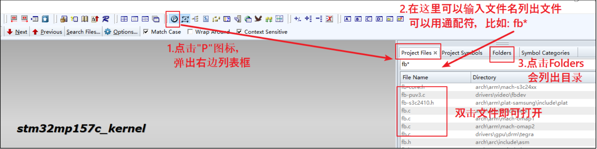
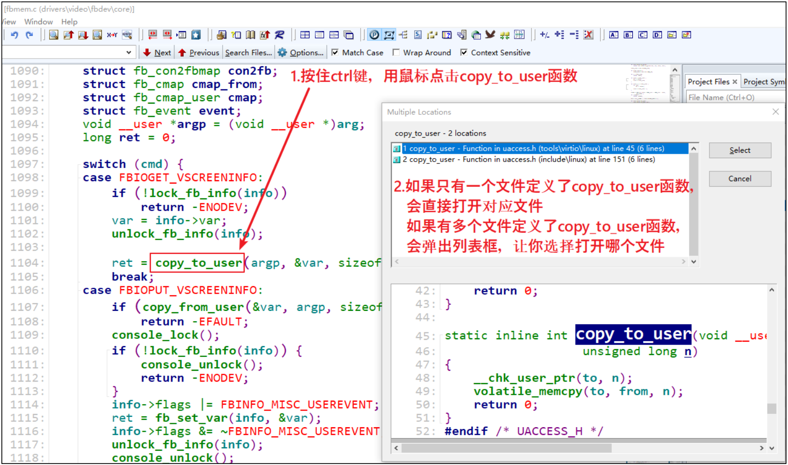
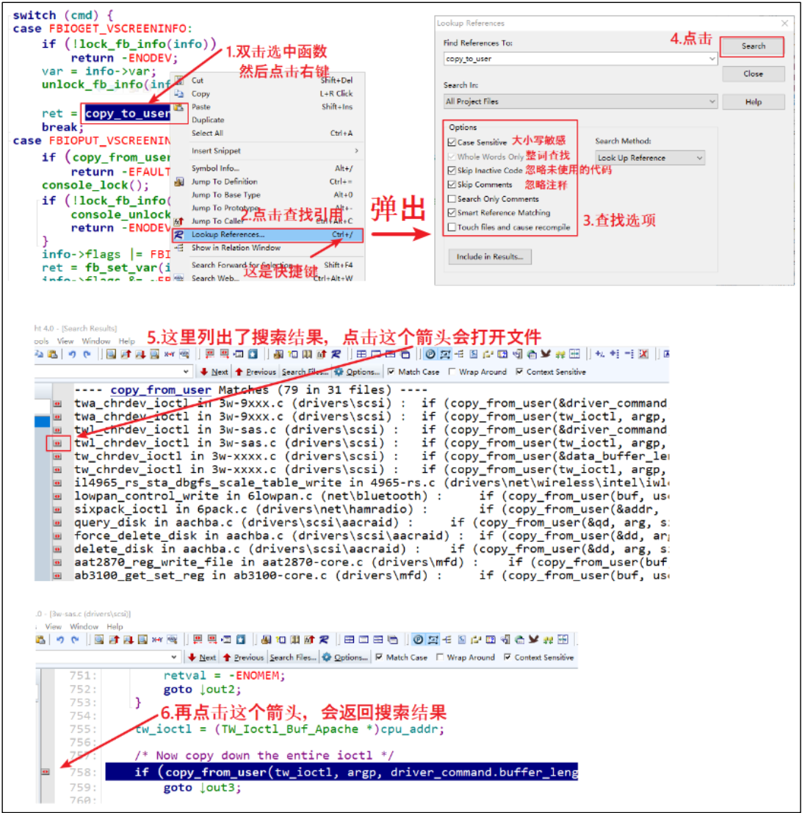

# Source Insight 使用

## 1 在工程中打开文件

## 2 在文件中查看函数或变量的定义

## 3 查找函数或变量的引用  

双击函数，右键点击弹出对话框选择`Lookup Reference`；或者双击函数后，使用快捷键`ctrl+/`来查找引用。

## 4 修改字体

1、右键Options->Preferences。如图所示，然后找到Syntax Decorations选项，点击File Types。
2、点击File Types后进如入下面界面 点击 Screen Font。
